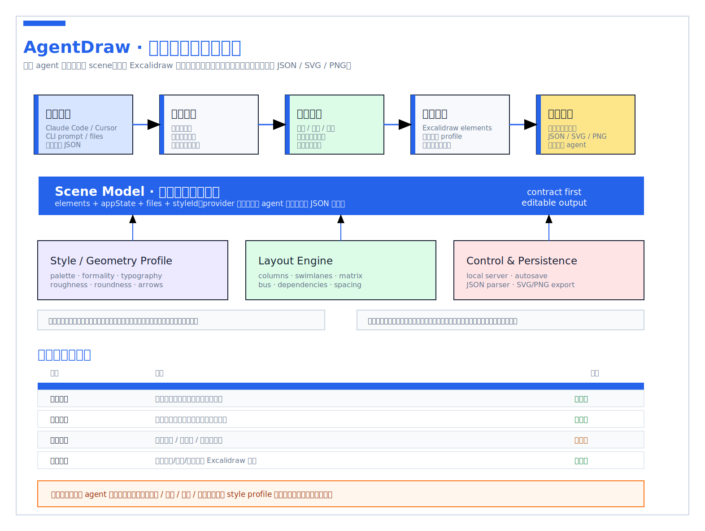

# AgentDraw

[中文 README](./README.zh.md)

AgentDraw is a local-first, editable whiteboard workspace for coding agents.

It lets Claude Code, Codex, Cursor, or any other agent generate a structured `.agentdraw.json`
scene, open it in a browser-based whiteboard editor, let a human refine it manually, and export the
result as JSON, SVG, or PNG.

The first canvas provider is Excalidraw. AgentDraw keeps the storage format, style system, local
server, and validation logic separate from the canvas implementation, so other providers can be
added later without replacing the whole app.

Powered by [Excalidraw](https://github.com/excalidraw/excalidraw).

## Install

Recommended: ask your coding agent to install both the CLI and the skill.

```text
Install AgentDraw:
npm install -g @aidraw/agentdraw
npx skills add chenhg5/agentdraw --skill agentdraw -g -y
```

Agent bootstrap URL:

```text
https://raw.githubusercontent.com/chenhg5/agentdraw/main/INSTALL.md
```

For human CLI-only usage:

```bash
npm install -g @aidraw/agentdraw
agentdraw --help
agentdraw guide
```

No global install:

```bash
npx @aidraw/agentdraw@latest open board.agentdraw.json --background --open
```

See [INSTALL.md](./INSTALL.md) for agent-specific install options.

## Gallery

AgentDraw examples are real editable scene files. The images below are generated previews for the
README; click a preview to open the source `.agentdraw.json`.

### Complex Board

<a href="./examples/complex-agentdraw-workbench.agentdraw.json">
  
</a>

### Theme Examples

<table>
<tr>
<td width="50%"><a href="./examples/theme-agentdraw-os.agentdraw.json"></a><br />
<sub><a href="./examples/theme-agentdraw-os.agentdraw.json"><b>AgentDraw OS</b></a> · local agent diagram loop</sub>
</td>
<td width="50%"><a href="./examples/theme-incident-command.agentdraw.json"></a><br />
<sub><a href="./examples/theme-incident-command.agentdraw.json"><b>Incident Command</b></a> · severity and recovery map</sub>
</td>
</tr>
<tr>
<td width="50%"><a href="./examples/theme-message-bus.agentdraw.json"></a><br />
<sub><a href="./examples/theme-message-bus.agentdraw.json"><b>Message Bus</b></a> · multi-agent coordination</sub>
</td>
<td width="50%"><a href="./examples/theme-launch-room.agentdraw.json"></a><br />
<sub><a href="./examples/theme-launch-room.agentdraw.json"><b>Launch Room</b></a> · editorial growth loop</sub>
</td>
</tr>
<tr>
<td width="50%"><a href="./examples/theme-strategy-grove.agentdraw.json"></a><br />
<sub><a href="./examples/theme-strategy-grove.agentdraw.json"><b>Strategy Grove</b></a> · quarterly operating map</sub>
</td>
<td width="50%"><a href="./examples/theme-roadmap-mint.agentdraw.json"></a><br />
<sub><a href="./examples/theme-roadmap-mint.agentdraw.json"><b>Roadmap Mint</b></a> · playful product roadmap</sub>
</td>
</tr>
<tr>
<td width="50%"><a href="./examples/theme-customer-journey.agentdraw.json"></a><br />
<sub><a href="./examples/theme-customer-journey.agentdraw.json"><b>Customer Journey</b></a> · activation signal map</sub>
</td>
<td width="50%"><a href="./examples/theme-research-synthesis.agentdraw.json"></a><br />
<sub><a href="./examples/theme-research-synthesis.agentdraw.json"><b>Research Synthesis</b></a> · interview clustering board</sub>
</td>
</tr>
<tr>
<td width="50%"><a href="./examples/theme-raw-grid.agentdraw.json"></a><br />
<sub><a href="./examples/theme-raw-grid.agentdraw.json"><b>Raw Grid</b></a> · strict validation matrix</sub>
</td>
<td width="50%"><a href="./examples/theme-bold-poster.agentdraw.json"></a><br />
<sub><a href="./examples/theme-bold-poster.agentdraw.json"><b>Bold Poster</b></a> · high-impact design thesis</sub>
</td>
</tr>
<tr>
<td width="50%"><a href="./examples/theme-soft-editorial.agentdraw.json"></a><br />
<sub><a href="./examples/theme-soft-editorial.agentdraw.json"><b>Soft Editorial</b></a> · research and discovery board</sub>
</td>
<td width="50%"><a href="./examples/theme-block-frame.agentdraw.json"></a><br />
<sub><a href="./examples/theme-block-frame.agentdraw.json"><b>BlockFrame</b></a> · playful maker workflow</sub>
</td>
</tr>
</table>

## Why

Agent-generated diagrams often fail in predictable ways: text overlaps, labels are not centered,
arrows miss their targets, or a complex scene opens under the toolbar. AgentDraw treats those as
engineering problems:

- diagrams are stored as editable structured JSON, not screenshots;
- styles are reusable presets rather than one-off colors;
- scenes can be validated before opening;
- humans can still edit the final board directly in the browser.

## Why AgentDraw Is Different

AgentDraw is built for the handoff between coding agents and humans. It is not only a canvas, and it
is not only a text-to-diagram renderer.

- **Agent-native workflow**: the CLI, schemas, `guide` commands, JSON output, and skill file are
  designed so Claude Code, Codex, Cursor, or another agent can discover the workflow and run it
  without guessing.
- **Local-first by default**: generated boards live in project-local `.agentdraw.json` files and open
  through a local server. Teams can keep diagrams next to code, prompts, docs, and eval artifacts.
- **Editable structured output**: the result is a real whiteboard scene, not a screenshot. Humans can
  adjust layout, labels, colors, and connectors in the browser after the agent drafts the board.
- **Design systems for agents**: each theme includes agent-readable `design.md` guidance plus a
  machine-readable contract for palette, typography, geometry, spacing, connectors, and avoid rules.
- **Quality gates before preview**: validation catches common generated-board failures such as text
  overflow, overlap, visual centering drift, connector mistakes, wrong font family, and style-contract
  drift.
- **Provider boundary**: Excalidraw is the first renderer, but AgentDraw keeps scene IO, style
  contracts, validation, local serving, and provider code separated so other canvases can be explored
  later.

## Similar Projects

AgentDraw is closest to AI diagram applications that combine an editable diagram surface with
agent- or chat-driven generation, such as
[`next-ai-draw-io`](https://github.com/DayuanJiang/next-ai-draw-io). That project focuses on
natural-language creation and editing of draw.io diagrams, including MCP access for agents.

AgentDraw takes a narrower local-agent workflow:

- install a CLI and skill directly inside a coding environment;
- generate project-local `.agentdraw.json` files instead of depending on a hosted workspace;
- load agent-readable design guides and machine-readable style contracts before drawing;
- validate layout, text, connectors, font choices, and style drift before opening the board;
- keep the canvas provider boundary explicit so Excalidraw is only the first renderer.

## Features

- Local `.agentdraw.json` scene files.
- Excalidraw-based editable canvas.
- 38 bundled styles, including formal diagram styles and palettes adapted from
  `beautiful-feishu-whiteboard`.
- CLI for opening and validating scenes.
- Machine-readable design contracts for palette, typography, geometry, spacing, connector rules,
  and style-specific avoid rules.
- Local HTTP API for loading and saving the current board.
- Export to JSON, SVG, and PNG.
- Scene validation for text overlap, shape overlap, vertical centering, connector endpoints,
  connectors crossing text, and style-contract drift.

## Quick Start

Run directly from npm:

```bash
npx @aidraw/agentdraw@latest open board.agentdraw.json --background --open
```

Or use the repo:

```bash
pnpm install
pnpm build
pnpm agentdraw open examples/complex-agentdraw-workbench.agentdraw.json
```

Open the printed URL in a browser. By default the local server uses:

```text
http://127.0.0.1:3927
```

For WSL or remote usage, run the server on the machine that has a browser:

```bash
pnpm agentdraw open examples/complex-agentdraw-workbench.agentdraw.json --background --open
```

For a headless host, keep the server in the background and return the URL:

```bash
pnpm agentdraw open examples/complex-agentdraw-workbench.agentdraw.json --background --no-open --format json
```

## CLI

Discover commands:

```bash
pnpm agentdraw --help
pnpm agentdraw schema open --json
pnpm agentdraw guide styles --json
```

Open a board:

```bash
pnpm agentdraw open examples/getting-started.agentdraw.json --background --open
```

Open without launching the system browser:

```bash
pnpm agentdraw open examples/getting-started.agentdraw.json --background --no-open --format json
```

Create a scene file without starting the editor:

```bash
pnpm agentdraw init .agentdraw/board.agentdraw.json
```

Boards replay their final scene by default when opened, so users can watch the diagram being drawn.
Disable the replay with any of these URL flags:

```text
?animate=0
?replay=0
?instant=1
```

Validate a generated scene:

```bash
pnpm validate:scene examples/complex-agentdraw-workbench.agentdraw.json
pnpm agentdraw validate examples/complex-agentdraw-workbench.agentdraw.json --format json
pnpm agentdraw validate examples/complex-agentdraw-workbench.agentdraw.json --style system-formal --format json
pnpm agentdraw quality examples/complex-agentdraw-workbench.agentdraw.json --style system-formal --format json
```

The validator returns a non-zero exit code for layout errors. Warnings are printed but do not fail
the command. Style-contract drift is reported as warnings so agents can repair weak outputs without
blocking intentionally custom boards. A typical agent loop should be:

```text
choose style -> load design guide + contract -> generate scene -> validate scene -> score quality -> repair reported element ids -> open board
```

## Example Sources

The gallery images are generated from these editable source files:

- [`examples/getting-started.agentdraw.json`](./examples/getting-started.agentdraw.json)
- [`examples/complex-agentdraw-workbench.agentdraw.json`](./examples/complex-agentdraw-workbench.agentdraw.json)
- [`examples/theme-agentdraw-os.agentdraw.json`](./examples/theme-agentdraw-os.agentdraw.json)
- [`examples/theme-incident-command.agentdraw.json`](./examples/theme-incident-command.agentdraw.json)
- [`examples/theme-message-bus.agentdraw.json`](./examples/theme-message-bus.agentdraw.json)
- [`examples/theme-launch-room.agentdraw.json`](./examples/theme-launch-room.agentdraw.json)
- [`examples/theme-strategy-grove.agentdraw.json`](./examples/theme-strategy-grove.agentdraw.json)
- [`examples/theme-roadmap-mint.agentdraw.json`](./examples/theme-roadmap-mint.agentdraw.json)
- [`examples/theme-customer-journey.agentdraw.json`](./examples/theme-customer-journey.agentdraw.json)
- [`examples/theme-research-synthesis.agentdraw.json`](./examples/theme-research-synthesis.agentdraw.json)
- [`examples/theme-raw-grid.agentdraw.json`](./examples/theme-raw-grid.agentdraw.json)
- [`examples/theme-bold-poster.agentdraw.json`](./examples/theme-bold-poster.agentdraw.json)
- [`examples/theme-soft-editorial.agentdraw.json`](./examples/theme-soft-editorial.agentdraw.json)
- [`examples/theme-block-frame.agentdraw.json`](./examples/theme-block-frame.agentdraw.json)

Regenerate the theme examples:

```bash
node scripts/generate-theme-examples.mjs
```

Regenerate the README preview images:

```bash
pnpm examples:previews
```

## Scene Format

An AgentDraw scene is a JSON envelope around provider-specific scene data:

```json
{
  "type": "agentdraw/scene",
  "version": 1,
  "title": "System map",
  "styleId": "system-formal",
  "providerId": "excalidraw",
  "elements": [],
  "appState": {},
  "files": {}
}
```

Agents usually generate or patch:

- `styleId`
- `providerId`
- `elements`
- `appState`
- `files`

The browser editor auto-saves manual edits back into the same file.

## Styles

Use a style id in the scene file, or switch styles from the toolbar. The default is:

```text
system-formal
```

Styles are intended to become design systems, not simple palette swaps. See
[`docs/STYLE_SYSTEM.md`](./docs/STYLE_SYSTEM.md) for the target architecture and
`packages/styles/designs/*/design.md` for agent-readable style rules.

Agents should load both the narrative guide and the machine-readable contract:

```bash
agentdraw guide style system-formal --format text
agentdraw guide contract system-formal --json
agentdraw validate-style system-formal --json
```

Formal styles:

- `system-formal`
- `boardroom`
- `blueprint-formal`

Additional palette presets are grouped as:

- restrained: `avocado-press`, `grove`, `jade-lens`, `long-table`, `macchiato`, `monochrome`,
  `papier-bleu`, `reading-room`, `salmon-stamp`
- balanced: `apricot-arc`, `berry-pop`, `bold-poster`, `checker-bloom`, `cobalt-bloom`, `coral`,
  `cut-bloom`, `editorial-forest`, `lime-slab`, `linen-cut`, `pin-and-paper`, `raw-grid`,
  `riptide-cobalt`, `soft-editorial`, `violet-marker`
- bold: `block-frame`, `burst-panel`, `confetti-wedge`, `court-press`, `crayon-stack`,
  `grove-block`, `mint-brut`, `neo-grid-bold`, `riso-brut`, `specimen-bold`, `stencil-tablet`

High-formality styles render with square geometry, zero roughness, sans text, and elbow-style
defaults. Low-formality styles keep a more hand-drawn Excalidraw feel.

## Validation

The scene validator is intentionally lightweight. It catches common generated-board mistakes before
the browser opens:

- text bounding boxes overlapping;
- non-contained shape overlaps;
- text groups that are visibly off-center inside short containers;
- connector endpoints that are far from the nearest shape;
- connectors that cross text bounding boxes.
- colors, roughness, stroke widths, or type sizes that drift from the selected design contract.

It is not a full visual renderer. For critical diagrams, use it as a first pass, then inspect the
board in the browser.

## Quality Scoring

`agentdraw quality` turns the first rubric into a machine-readable preflight score:

```bash
agentdraw quality examples/complex-agentdraw-workbench.agentdraw.json --style system-formal --json
```

It scores task fit, structure, visual design, readability, connector quality, and validation/editability
on a 24-point scale. The task-fit dimension is marked as review-required because the CLI cannot know
the user's original prompt; use the score as a guardrail, not as a replacement for prompt-aware review.

## Development

```bash
pnpm install
pnpm typecheck
pnpm build
```

## Agent Skill

Agents should install [`skills/agentdraw/SKILL.md`](./skills/agentdraw/SKILL.md), then use the CLI
for version-matched guidance:

```bash
agentdraw guide styles --json
agentdraw guide style system-formal --format text
agentdraw guide contract system-formal --json
agentdraw quality .agentdraw/board.agentdraw.json --style system-formal --json
agentdraw guide quality --format text
```

## Evaluation

Use [`evals/`](./evals) to check whether the skill produces boards that are useful, editable, and
visually intentional. The first eval set includes prompts and a 24-point rubric for task fit,
structure, visual design, readability, connector quality, and validation.

Run the web app and API in development mode:

```bash
pnpm dev
```

Project layout:

```text
apps/web/          browser editor
packages/cli/      agentdraw command
packages/server/   local HTTP server
packages/scene/    scene IO and validation
packages/styles/   style catalog, render profiles, and design contracts
examples/          sample scenes
scripts/           repo utility scripts
```

## Repository

```bash
git remote add origin git@github.com:chenhg5/agentdraw.git
```

## License

[MIT](./LICENSE)

AgentDraw is powered by [Excalidraw](https://github.com/excalidraw/excalidraw).
