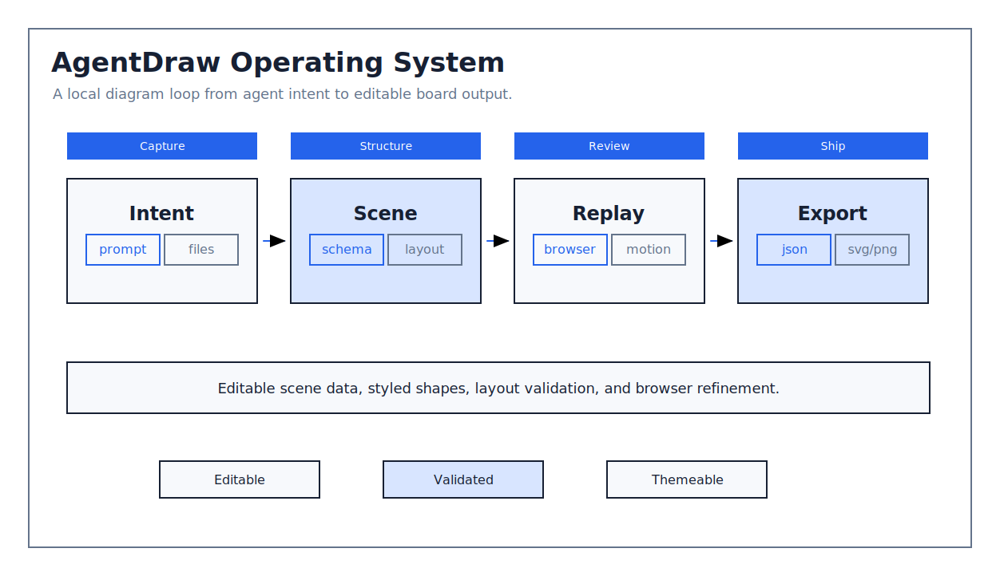
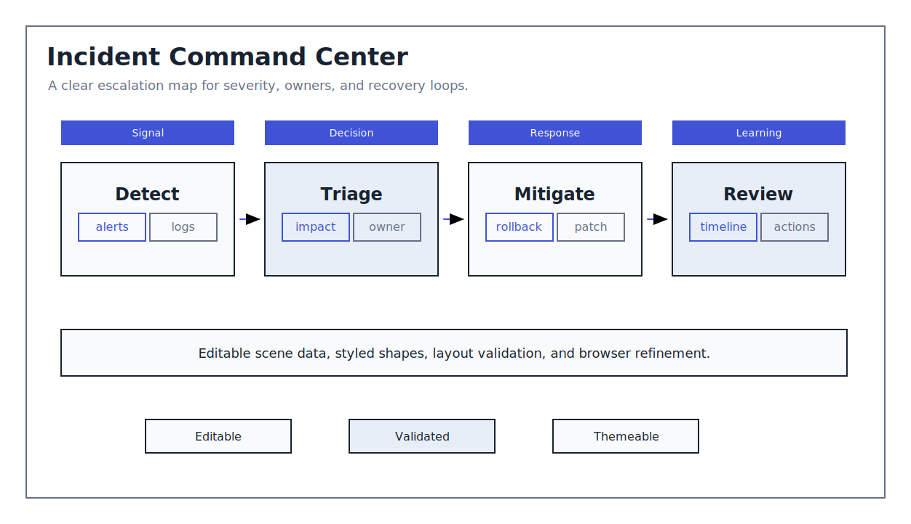
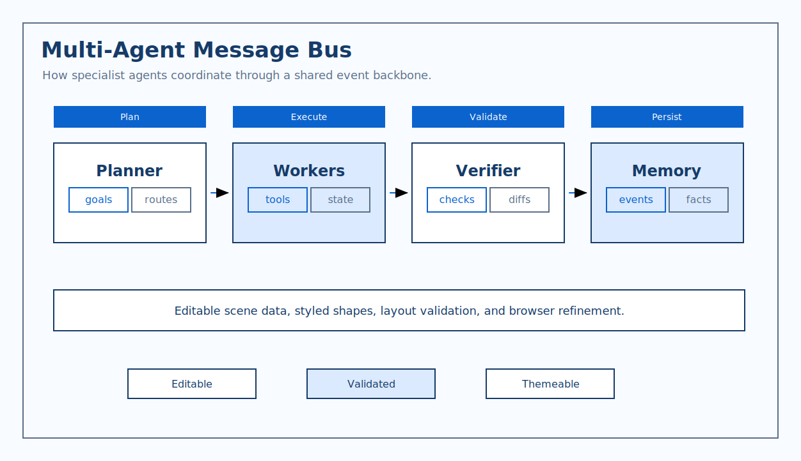
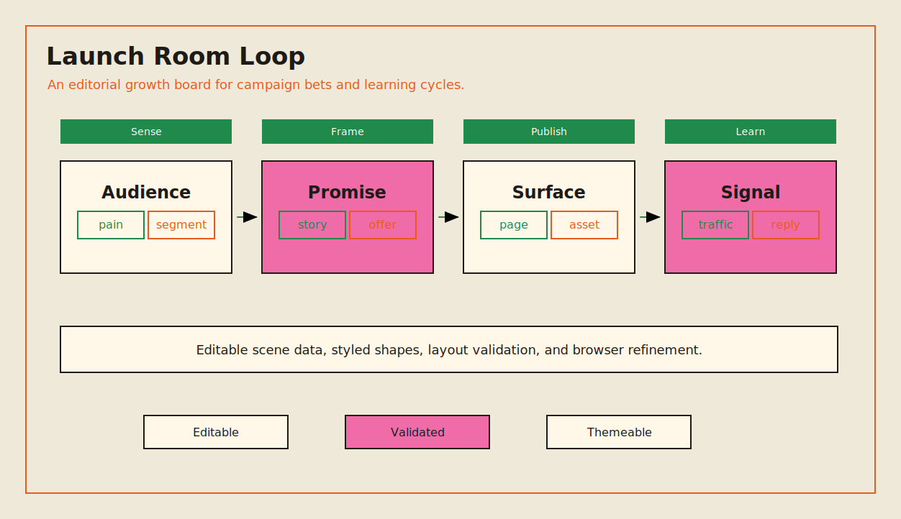
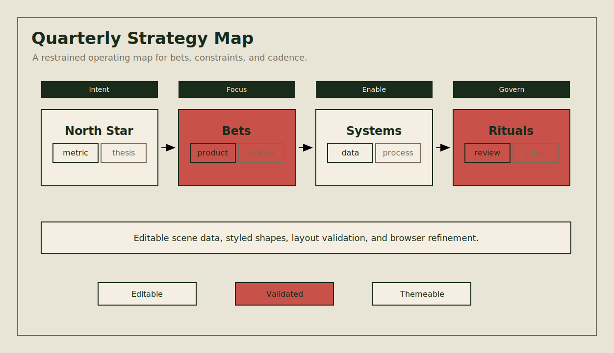
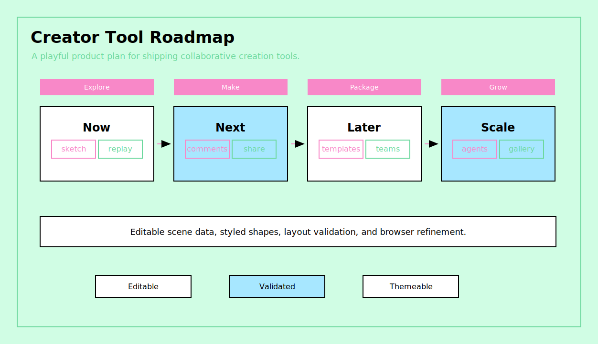
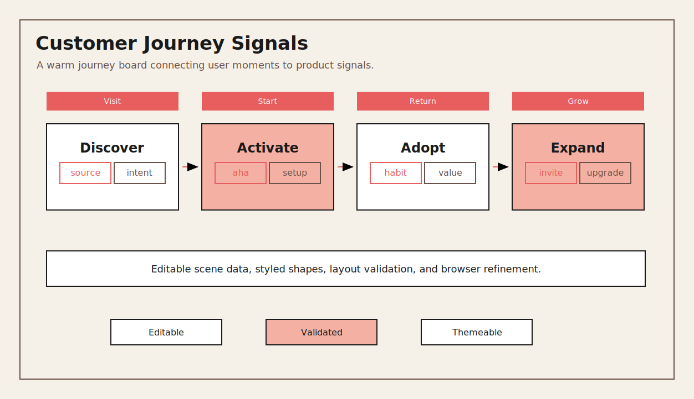
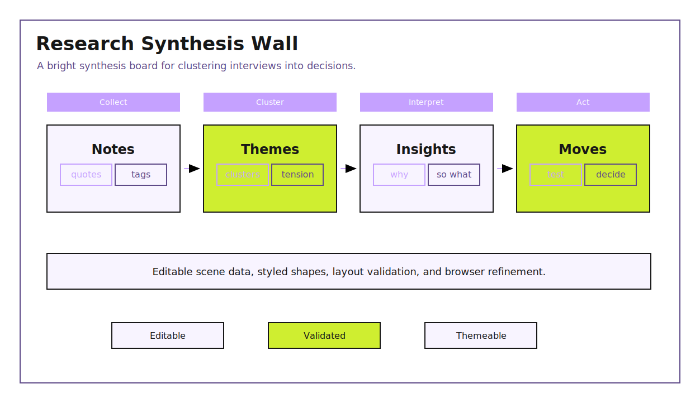

# AgentDraw

[中文 README](./README.zh.md)

[](https://www.npmjs.com/package/@aidraw/agentdraw)
[](./LICENSE)
[](#svg-first-format)
[](#why-agentdraw)
[](https://github.com/excalidraw/excalidraw)
[](./skills/agentdraw/SKILL.md)

AgentDraw is a local-first, SVG-first editable whiteboard workspace for coding agents.

It lets Claude Code, Codex, Cursor, or any other agent draft a clean SVG diagram, convert it into an
editable `.agentdraw.json` whiteboard, open it in a browser editor, let a human refine it manually,
and export the result as JSON, SVG, or PNG.

The first canvas provider is Excalidraw. AgentDraw uses SVG as the agent-friendly source draft and
`.agentdraw.json` as the editable browser format.

Powered by [Excalidraw](https://github.com/excalidraw/excalidraw).

## Install

Recommended: ask your coding agent to install both the CLI and the skill.

```text
Install AgentDraw:
npm install -g @aidraw/agentdraw
npx skills add chenhg5/agentdraw --skill agentdraw -g -y
```

Agent bootstrap URL:

```text
https://raw.githubusercontent.com/chenhg5/agentdraw/main/INSTALL.md
```

For human CLI-only usage:

```bash
npm install -g @aidraw/agentdraw
agentdraw --help
agentdraw guide
```

No global install:

```bash
npx @aidraw/agentdraw@latest import-mermaid flow.mmd --out flow.agentdraw.json --style blueprint-formal --json
npx @aidraw/agentdraw@latest import-svg board.svg --out board.agentdraw.json --style boardroom --json
npx @aidraw/agentdraw@latest open board.agentdraw.json --background --open
```

See [INSTALL.md](./INSTALL.md) for agent-specific install options.

## Gallery

AgentDraw examples are generated previews. Theme previews link to the `design.md` system that
produced the look.

### Complex Board

<a href="./examples/complex-agentdraw-workbench.agentdraw.json">
  
</a>

### Theme Examples

<table>
<tr>
<td width="50%"><a href="./packages/styles/designs/system-formal/design.md"></a><br />
<sub><a href="./packages/styles/designs/system-formal/design.md"><b>System Formal</b></a> · precise architecture and workflow diagrams</sub>
</td>
<td width="50%"><a href="./packages/styles/designs/boardroom/design.md"></a><br />
<sub><a href="./packages/styles/designs/boardroom/design.md"><b>Boardroom</b></a> · executive operating reviews and decisions</sub>
</td>
</tr>
<tr>
<td width="50%"><a href="./packages/styles/designs/blueprint-formal/design.md"></a><br />
<sub><a href="./packages/styles/designs/blueprint-formal/design.md"><b>Blueprint Formal</b></a> · technical systems and protocols</sub>
</td>
<td width="50%"><a href="./packages/styles/designs/runtime-doc/design.md"></a><br />
<sub><a href="./packages/styles/designs/runtime-doc/design.md"><b>Runtime Doc</b></a> · technical document explainers</sub>
</td>
</tr>
<tr>
<td width="50%"><a href="./packages/styles/designs/slate-notes/design.md"></a><br />
<sub><a href="./packages/styles/designs/slate-notes/design.md"><b>Slate Notes</b></a> · clean product spec boards</sub>
</td>
<td width="50%"><a href="./packages/styles/designs/manual-cream/design.md"></a><br />
<sub><a href="./packages/styles/designs/manual-cream/design.md"><b>Manual Cream</b></a> · retro instruction manuals</sub>
</td>
</tr>
<tr>
<td width="50%"><a href="./packages/styles/designs/riso-brut/design.md"></a><br />
<sub><a href="./packages/styles/designs/riso-brut/design.md"><b>Riso Brut</b></a> · editorial launch and growth loops</sub>
</td>
<td width="50%"><a href="./packages/styles/designs/grove/design.md"></a><br />
<sub><a href="./packages/styles/designs/grove/design.md"><b>Grove</b></a> · grounded strategy and planning maps</sub>
</td>
</tr>
<tr>
<td width="50%"><a href="./packages/styles/designs/mint-brut/design.md"></a><br />
<sub><a href="./packages/styles/designs/mint-brut/design.md"><b>Mint Brut</b></a> · playful product roadmaps</sub>
</td>
<td width="50%"><a href="./packages/styles/designs/coral/design.md"></a><br />
<sub><a href="./packages/styles/designs/coral/design.md"><b>Coral</b></a> · warm journeys and onboarding maps</sub>
</td>
</tr>
<tr>
<td width="50%"><a href="./packages/styles/designs/violet-marker/design.md"></a><br />
<sub><a href="./packages/styles/designs/violet-marker/design.md"><b>Violet Marker</b></a> · clustering and research walls</sub>
</td>
<td width="50%"><a href="./packages/styles/designs/archive-shelf/design.md"></a><br />
<sub><a href="./packages/styles/designs/archive-shelf/design.md"><b>Archive Shelf</b></a> · catalog-card research maps</sub>
</td>
</tr>
<tr>
<td width="50%"><a href="./packages/styles/designs/inkline/design.md"></a><br />
<sub><a href="./packages/styles/designs/inkline/design.md"><b>Inkline</b></a> · severe technical memos and specs</sub>
</td>
<td width="50%"><a href="./packages/styles/designs/espresso-paper/design.md"></a><br />
<sub><a href="./packages/styles/designs/espresso-paper/design.md"><b>Espresso Paper</b></a> · warm executive decision pages</sub>
</td>
</tr>
<tr>
<td width="50%"><a href="./packages/styles/designs/incident-dark/design.md"></a><br />
<sub><a href="./packages/styles/designs/incident-dark/design.md"><b>Incident Dark</b></a> · dark RCA and incident reports</sub>
</td>
<td width="50%"><a href="./packages/styles/designs/neon-grid/design.md"></a><br />
<sub><a href="./packages/styles/designs/neon-grid/design.md"><b>Neon Grid</b></a> · high-energy event and signal maps</sub>
</td>
</tr>
<tr>
<td width="50%"><a href="./packages/styles/designs/soft-pop/design.md"></a><br />
<sub><a href="./packages/styles/designs/soft-pop/design.md"><b>Soft Pop</b></a> · friendly product and onboarding maps</sub>
</td>
<td width="50%"><a href="./packages/styles/designs/raw-grid/design.md"></a><br />
<sub><a href="./packages/styles/designs/raw-grid/design.md"><b>Raw Grid</b></a> · strict validation and issue matrices</sub>
</td>
</tr>
<tr>
<td width="50%"><a href="./packages/styles/designs/bold-poster/design.md"></a><br />
<sub><a href="./packages/styles/designs/bold-poster/design.md"><b>Bold Poster</b></a> · high-impact thesis boards</sub>
</td>
<td width="50%"><a href="./packages/styles/designs/soft-editorial/design.md"></a><br />
<sub><a href="./packages/styles/designs/soft-editorial/design.md"><b>Soft Editorial</b></a> · research and discovery boards</sub>
</td>
</tr>
<tr>
<td width="50%"><a href="./packages/styles/designs/block-frame/design.md"></a><br />
<sub><a href="./packages/styles/designs/block-frame/design.md"><b>BlockFrame</b></a> · playful maker workflows</sub>
</td>
<td width="50%"><a href="./packages/styles/designs/long-table/design.md"></a><br />
<sub><a href="./packages/styles/designs/long-table/design.md"><b>Long Table</b></a> · warm action tables and agendas</sub>
</td>
</tr>
</table>

## Why

Agent-generated diagrams often fail in predictable ways: text overlaps, labels are not centered,
arrows miss their targets, or raw whiteboard JSON drifts into messy coordinates. AgentDraw treats
those as engineering problems:

- agents draft diagrams as simple, inspectable SVG first;
- SVG is converted into editable structured JSON, not screenshots;
- styles are reusable design systems rather than one-off colors;
- imported scenes can be repaired and validated before opening;
- humans can still edit the final board directly in the browser.

## Why AgentDraw

AgentDraw is built for the handoff between coding agents and humans. It is not trying to be a full
hosted AI diagram app; it is a small local tool that agents can install, reason about, validate, and
open for a human to edit.

- **Made for coding agents, not only chat users**: the CLI, schemas, `guide` commands, JSON output,
  and skill file are designed so Claude Code, Codex, Cursor, or another agent can discover the
  workflow and run it without guessing.
- **SVG-first generation**: agents are much better at producing aligned SVG than hand-placed
  whiteboard JSON. AgentDraw turns that stable SVG draft into editable browser objects.
- **Local-first by default**: generated boards live in project-local `.agentdraw.json` files and open
  through a local server. Teams can keep diagrams next to code, prompts, docs, and eval artifacts
  instead of sending every draft through a hosted workspace.
- **Editable structured output**: the result is a real whiteboard scene, not a screenshot. Humans can
  adjust layout, labels, colors, and connectors in the browser after the agent drafts the board.
- **Design systems before drawing**: each theme includes agent-readable `design.md` guidance plus a
  machine-readable contract for palette, typography, geometry, spacing, connectors, and avoid rules,
  so the agent has a design standard instead of just picking colors.
- **Quality gates before preview**: validation catches common generated-board failures such as text
  overflow, overlap, visual centering drift, connector mistakes, wrong font family, and style-contract
  drift.
- **A tighter scope than AI draw.io apps**: projects like
  [`next-ai-draw-io`](https://github.com/DayuanJiang/next-ai-draw-io) focus on chat-driven creation
  and editing of draw.io diagrams. AgentDraw focuses on local agent workflows: generate a structured
  scene, check it, open it, edit it, and keep the artifact in the project.
- **Provider boundary**: Excalidraw is the first editor, but AgentDraw keeps SVG import, scene IO,
  style contracts, validation, local serving, and provider code separated.

## Features

- SVG-first agent workflow with editable `.agentdraw.json` output.
- Restricted SVG importer for `rect`, `circle`, `ellipse`, `line`, `polyline`, `polygon`, `text/tspan`, groups,
  and arrow markers.
- Excalidraw-based editable canvas.
- 44 bundled styles, including formal diagram styles and palettes adapted from
  `beautiful-feishu-whiteboard`.
- CLI for opening and validating scenes.
- Machine-readable design contracts for palette, typography, geometry, spacing, connector rules,
  and style-specific avoid rules.
- Local HTTP API for loading and saving the current board.
- Export to JSON, SVG, and PNG.
- Scene validation for text overlap, shape overlap, vertical centering, connector endpoints,
  connectors crossing text, and style-contract drift.

## Quick Start

Draft a board as SVG, convert it, then open the editable result:

```bash
npx @aidraw/agentdraw@latest import-svg board.svg --out board.agentdraw.json --style boardroom --json
npx @aidraw/agentdraw@latest repair board.agentdraw.json --style boardroom --write --json
npx @aidraw/agentdraw@latest validate board.agentdraw.json --style boardroom --json
npx @aidraw/agentdraw@latest open board.agentdraw.json --background --open
```

Or use the repo:

```bash
pnpm install
pnpm build
pnpm agentdraw open examples/complex-agentdraw-workbench.agentdraw.json
```

Open the printed URL in a browser. By default the local server uses:

```text
http://127.0.0.1:3927
```

For WSL or remote usage, run the server on the machine that has a browser:

```bash
pnpm agentdraw open examples/complex-agentdraw-workbench.agentdraw.json --background --open
```

For a headless host, keep the server in the background and return the URL:

```bash
pnpm agentdraw open examples/complex-agentdraw-workbench.agentdraw.json --background --no-open --format json
```

## CLI

Discover commands:

```bash
pnpm agentdraw --help
pnpm agentdraw schema open --json
pnpm agentdraw guide styles --json
```

Open a board:

```bash
pnpm agentdraw open examples/getting-started.agentdraw.json --background --open
```

Open without launching the system browser:

```bash
pnpm agentdraw open examples/getting-started.agentdraw.json --background --no-open --format json
```

Create a scene file without starting the editor:

```bash
pnpm agentdraw init .agentdraw/board.agentdraw.json
```

Convert a restricted SVG into an editable board:

```bash
pnpm agentdraw import-svg .agentdraw/board.svg --out .agentdraw/board.agentdraw.json --style boardroom --title "Agent workflow" --json
```

Convert a Mermaid flowchart into an editable board:

```bash
pnpm agentdraw import-mermaid .agentdraw/flow.mmd --out .agentdraw/flow.agentdraw.json --style blueprint-formal --title "Decision flow" --json
```

Export a rendered preview for visual review:

```bash
pnpm agentdraw export examples/getting-started.agentdraw.json --format png --out .agentdraw/getting-started.preview.png --scale 2 --json
```

Boards open instantly by default. Enable replay only when you explicitly want to watch the diagram
being drawn:

```text
?animate=1
?replay=1
```

Validate a generated scene:

```bash
pnpm validate:scene examples/complex-agentdraw-workbench.agentdraw.json
pnpm agentdraw validate examples/complex-agentdraw-workbench.agentdraw.json --format json
pnpm agentdraw validate examples/complex-agentdraw-workbench.agentdraw.json --style system-formal --format json
pnpm agentdraw repair examples/complex-agentdraw-workbench.agentdraw.json --style system-formal --write --format json
pnpm agentdraw quality examples/complex-agentdraw-workbench.agentdraw.json --style system-formal --format json
pnpm agentdraw export examples/complex-agentdraw-workbench.agentdraw.json --format png --out .agentdraw/complex.preview.png --json
pnpm agentdraw gallery --no-open --format json
```

The validator returns a non-zero exit code for layout errors. Warnings are printed but do not fail
the command. Style-contract drift is reported as warnings so agents can repair weak outputs without
blocking intentionally custom boards. A typical agent loop should be:

```text
choose style -> load design guide + contract -> choose Mermaid for standard flowcharts or SVG for high-design boards -> inspect source -> import -> repair -> validate -> score quality -> export preview when quality matters -> revise source if needed -> open board
```

Use `agentdraw import-mermaid` for conventional flowcharts and decision flows. Use
`agentdraw guide scene` and `agentdraw guide patterns --json` before generating SVG. The SVG
contract keeps the source draft simple enough to import into editable objects while preserving the
layout quality agents usually achieve with SVG. `agentdraw repair` normalizes deterministic display
defaults after import. Use `agentdraw gallery --open` when the user has not expressed a visual
preference and should choose between theme directions.

## SVG-First Format

AgentDraw's recommended source format is a restricted SVG:

```svg
<svg width="1200" height="760" viewBox="0 0 1200 760" xmlns="http://www.w3.org/2000/svg">
  <defs>
    <marker id="arrow" markerWidth="10" markerHeight="10" refX="8" refY="5" orient="auto">
      <path d="M 0 0 L 10 5 L 0 10 z" fill="#64748B" />
    </marker>
  </defs>
  <rect x="80" y="80" width="1040" height="600" rx="10" fill="#FFFFFF" stroke="#172033" />
  <text x="120" y="140" font-family="Inter, Arial, sans-serif" font-size="34" font-weight="750" fill="#172033">System map</text>
</svg>
```

Supported import tags are `svg`, `g`, `rect`, `circle`, `ellipse`, `line`, `polyline`, `polygon`, `text`,
`tspan`, `defs`, and `marker`. Keep text as real text. Avoid `foreignObject`, `image`, `clipPath`,
`mask`, `filter`, gradients, and arbitrary paths for editable boards.

## Scene Format

An AgentDraw scene is the editable browser storage format produced by `agentdraw import-svg`.
Agents should treat it as generated output, not the source drawing language.

Advanced agents may patch these fields only when updating an existing board:

- `styleId`
- `providerId`
- `elements`
- `appState`
- `files`

The browser editor auto-saves manual edits back into the same file.

## Styles

Use a style id in the scene file, or switch styles from the toolbar. The default is:

```text
system-formal
```

Styles are intended to become design systems, not simple palette swaps. See
[`docs/STYLE_SYSTEM.md`](./docs/STYLE_SYSTEM.md) for the target architecture and
`packages/styles/designs/*/design.md` for agent-readable style rules.

Agents should load both the narrative guide and the machine-readable contract:

```bash
agentdraw guide style system-formal --format text
agentdraw guide contract system-formal --json
agentdraw guide patterns --json
agentdraw gallery --open --format json
agentdraw validate-style system-formal --json
```

Formal styles:

- `system-formal`
- `boardroom`
- `blueprint-formal`

Additional palette presets are grouped as:

- restrained: `archive-shelf`, `avocado-press`, `espresso-paper`, `grove`, `inkline`, `jade-lens`,
  `long-table`, `manual-cream`, `papier-bleu`, `runtime-doc`, `salmon-stamp`, `slate-notes`
- balanced: `apricot-arc`, `berry-pop`, `bold-poster`, `checker-bloom`, `cobalt-bloom`, `coral`,
  `cut-bloom`, `editorial-forest`, `incident-dark`, `lime-slab`, `linen-cut`, `pin-and-paper`,
  `raw-grid`, `riptide-cobalt`, `soft-editorial`, `soft-pop`, `violet-marker`
- bold: `block-frame`, `burst-panel`, `confetti-wedge`, `court-press`, `crayon-stack`,
  `grove-block`, `mint-brut`, `neo-grid-bold`, `neon-grid`, `riso-brut`, `specimen-bold`,
  `stencil-tablet`

High-formality styles render with square geometry, zero roughness, sans text, and elbow-style
defaults. Low-formality styles keep a more hand-drawn Excalidraw feel.

## Validation

The scene validator is intentionally lightweight. It catches common generated-board mistakes before
the browser opens:

- text bounding boxes overlapping;
- non-contained shape overlaps;
- text groups that are visibly off-center inside short containers;
- connector endpoints that are far from the nearest shape;
- connectors that cross text bounding boxes.
- colors, roughness, stroke widths, or type sizes that drift from the selected design contract.

It is not a full visual renderer. For critical diagrams, use it as a first pass, then inspect the
board in the browser.

## Quality Scoring

`agentdraw quality` turns the first rubric into a machine-readable preflight score:

```bash
agentdraw quality examples/complex-agentdraw-workbench.agentdraw.json --style system-formal --json
```

It scores task fit, structure, visual design, readability, connector quality, and validation/editability
on a 24-point scale. The task-fit dimension is marked as review-required because the CLI cannot know
the user's original prompt; use the score as a guardrail, not as a replacement for prompt-aware review.

## Development

```bash
pnpm install
pnpm typecheck
pnpm build
```

## Agent Skill

Agents should install [`skills/agentdraw/SKILL.md`](./skills/agentdraw/SKILL.md), then use the CLI
for version-matched guidance:

```bash
agentdraw guide styles --json
agentdraw gallery --no-open --format json
agentdraw guide style system-formal --format text
agentdraw guide contract system-formal --json
agentdraw guide patterns --json
agentdraw import-mermaid .agentdraw/flow.mmd --out .agentdraw/flow.agentdraw.json --style blueprint-formal --json
agentdraw import-svg .agentdraw/board.svg --out .agentdraw/board.agentdraw.json --style system-formal --json
agentdraw repair .agentdraw/board.agentdraw.json --style system-formal --write --json
agentdraw validate .agentdraw/board.agentdraw.json --style system-formal --json
agentdraw quality .agentdraw/board.agentdraw.json --style system-formal --json
agentdraw guide quality --format text
```

## Evaluation

Use [`evals/`](./evals) to check whether the skill produces boards that are useful, editable, and
visually intentional. The first eval set includes prompts and a 24-point rubric for task fit,
structure, visual design, readability, connector quality, and validation.

Run the web app and API in development mode:

```bash
pnpm dev
```

Project layout:

```text
apps/web/          browser editor
packages/cli/      agentdraw command
packages/server/   local HTTP server
packages/scene/    scene IO and validation
packages/styles/   style catalog, render profiles, and design contracts
examples/          sample scenes
scripts/           repo utility scripts
```

## Repository

```bash
git remote add origin git@github.com:chenhg5/agentdraw.git
```

## License

[MIT](./LICENSE)

AgentDraw is powered by [Excalidraw](https://github.com/excalidraw/excalidraw).
