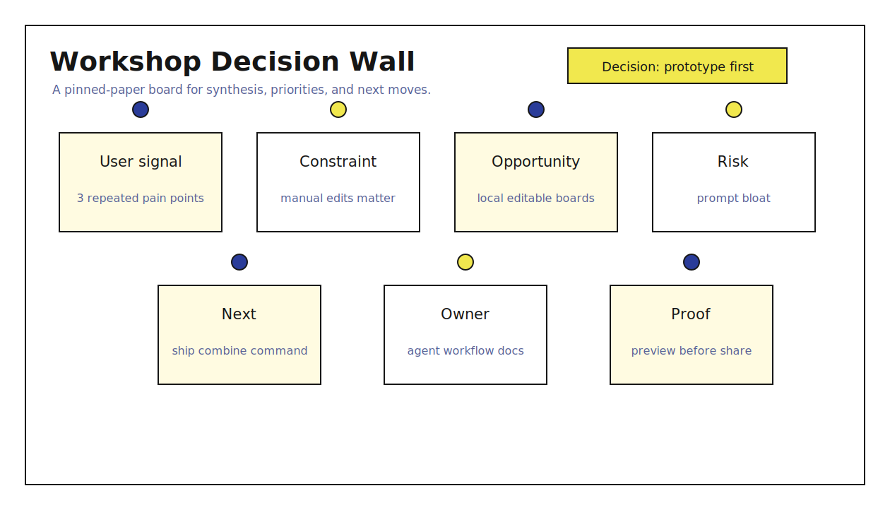
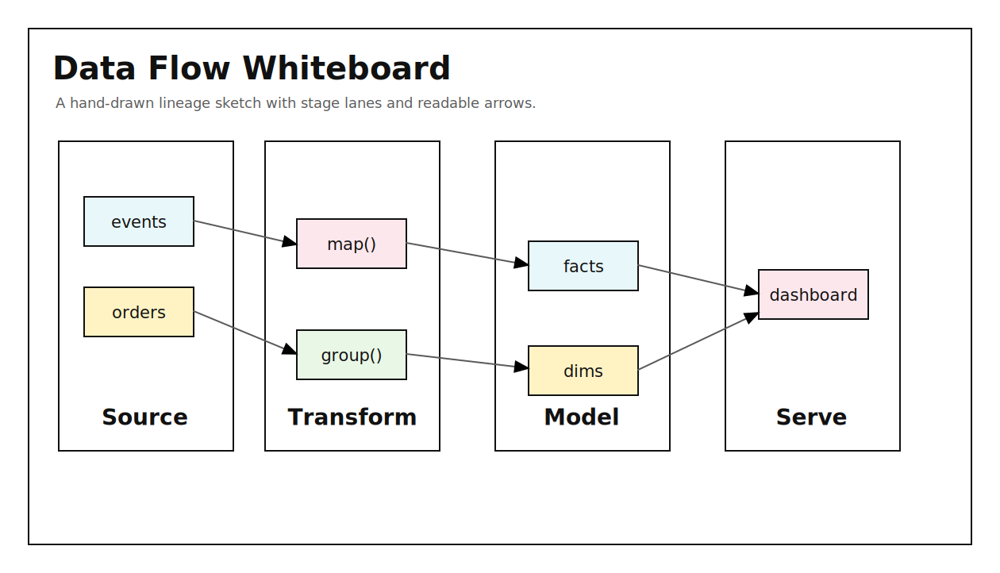
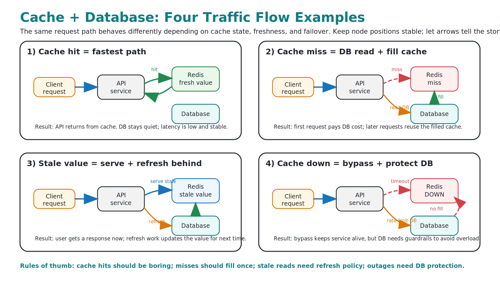
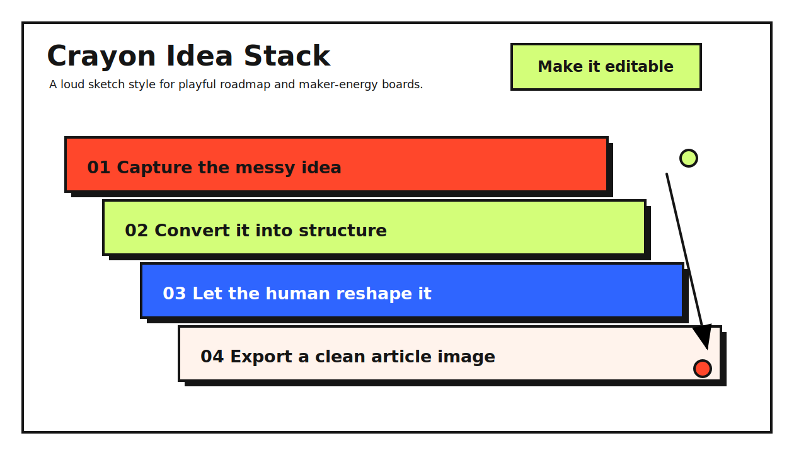
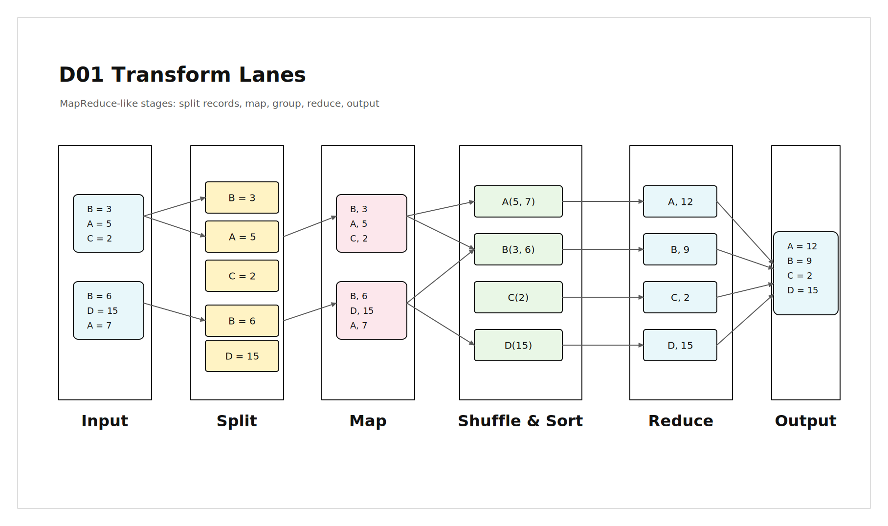
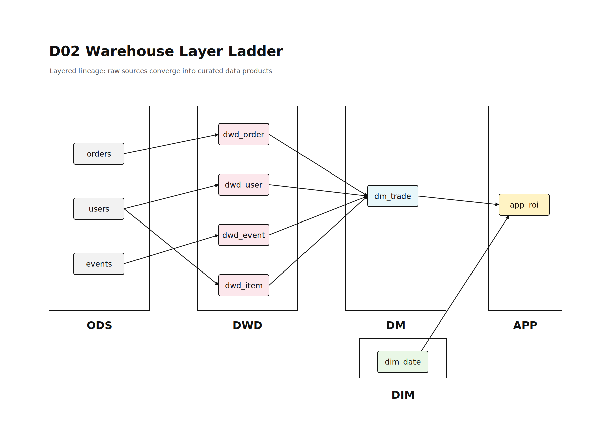
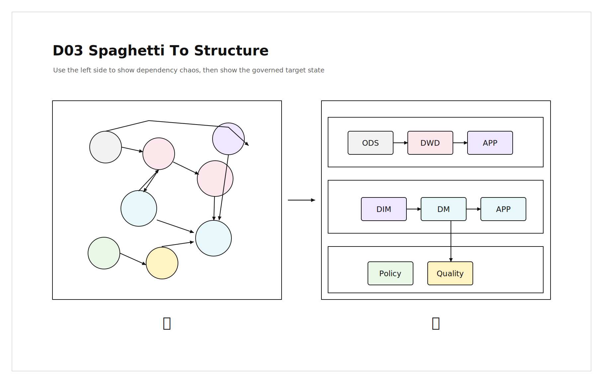
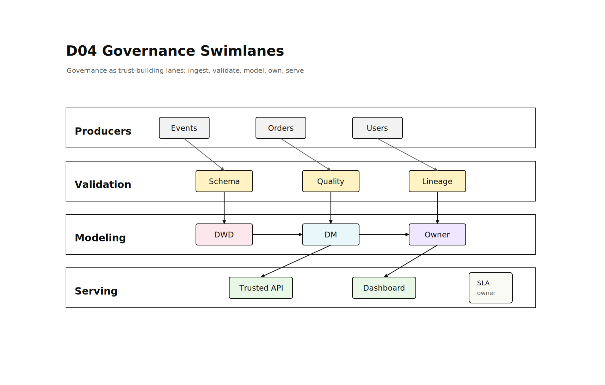

# AgentDraw

[中文 README](./README.zh.md)

[](https://www.npmjs.com/package/@aidraw/agentdraw)
[](./LICENSE)
[](#core-ideas)
[](#why-agentdraw)
[](https://github.com/excalidraw/excalidraw)
[](./skills/agentdraw/SKILL.md)

AgentDraw helps coding agents create editable diagrams and article-style visual boards.

Ask Claude Code, Codex, Cursor, or another agent to draft a clean SVG or Mermaid diagram, convert it
into an editable `.agentdraw.json` whiteboard, open it in a local browser editor, and export JSON,
SVG, or PNG when you need to share the result.

## Install

Recommended for agent workflows:

```bash
npm install -g @aidraw/agentdraw
npx skills add agentdraw/agentdraw --skill agentdraw -g -y
```

Agent bootstrap URL:

```text
https://raw.githubusercontent.com/agentdraw/agentdraw/main/INSTALL.md
```

CLI-only usage:

```bash
npm install -g @aidraw/agentdraw
agentdraw --help
agentdraw guide
```

No global install:

```bash
npx @aidraw/agentdraw@latest import-svg board.svg --out board.agentdraw.json --style boardroom --json
npx @aidraw/agentdraw@latest open board.agentdraw.json --background --open
```

## Quick Start

Convert an SVG draft into an editable local board:

```bash
npx @aidraw/agentdraw@latest import-svg board.svg --out board.agentdraw.json --style boardroom --json
npx @aidraw/agentdraw@latest repair board.agentdraw.json --style boardroom --write --json
npx @aidraw/agentdraw@latest validate board.agentdraw.json --style boardroom --json
npx @aidraw/agentdraw@latest open board.agentdraw.json --background --open
```

Use Mermaid for formal diagram grammar:

```bash
npx @aidraw/agentdraw@latest import-mermaid flow.mmd --out flow.agentdraw.json --style blueprint-formal --json
```

Run from this repository:

```bash
pnpm install
pnpm build
pnpm agentdraw open examples/complex-agentdraw-workbench.agentdraw.json --background --open
```

## Gallery

AgentDraw examples are real editable scene files. Preview images are shown here for scanning; click
an image to open the corresponding `.agentdraw.json` source.

### Complex Board

<a href="./examples/complex-agentdraw-workbench.agentdraw.json">
  
</a>

<details open>
<summary><b>Theme Examples</b> · bundled design systems and visual moods</summary>

Theme previews link to the `design.md` system that produced the look.

<table>
<tr>
<td width="50%"><a href="./packages/styles/designs/system-formal/design.md"></a><br />
<sub><a href="./packages/styles/designs/system-formal/design.md"><b>System Formal</b></a> · precise architecture and workflow diagrams</sub>
</td>
<td width="50%"><a href="./packages/styles/designs/boardroom/design.md"></a><br />
<sub><a href="./packages/styles/designs/boardroom/design.md"><b>Boardroom</b></a> · executive operating reviews and decisions</sub>
</td>
</tr>
<tr>
<td width="50%"><a href="./packages/styles/designs/blueprint-formal/design.md"></a><br />
<sub><a href="./packages/styles/designs/blueprint-formal/design.md"><b>Blueprint Formal</b></a> · technical systems and protocols</sub>
</td>
<td width="50%"><a href="./packages/styles/designs/runtime-doc/design.md"></a><br />
<sub><a href="./packages/styles/designs/runtime-doc/design.md"><b>Runtime Doc</b></a> · technical document explainers</sub>
</td>
</tr>
<tr>
<td width="50%"><a href="./packages/styles/designs/slate-notes/design.md"></a><br />
<sub><a href="./packages/styles/designs/slate-notes/design.md"><b>Slate Notes</b></a> · clean product spec boards</sub>
</td>
<td width="50%"><a href="./packages/styles/designs/manual-cream/design.md"></a><br />
<sub><a href="./packages/styles/designs/manual-cream/design.md"><b>Manual Cream</b></a> · retro instruction manuals</sub>
</td>
</tr>
<tr>
<td width="50%"><a href="./packages/styles/designs/riso-brut/design.md"></a><br />
<sub><a href="./packages/styles/designs/riso-brut/design.md"><b>Riso Brut</b></a> · editorial launch and growth loops</sub>
</td>
<td width="50%"><a href="./packages/styles/designs/grove/design.md"></a><br />
<sub><a href="./packages/styles/designs/grove/design.md"><b>Grove</b></a> · grounded strategy and planning maps</sub>
</td>
</tr>
<tr>
<td width="50%"><a href="./packages/styles/designs/mint-brut/design.md"></a><br />
<sub><a href="./packages/styles/designs/mint-brut/design.md"><b>Mint Brut</b></a> · playful product roadmaps</sub>
</td>
<td width="50%"><a href="./packages/styles/designs/coral/design.md"></a><br />
<sub><a href="./packages/styles/designs/coral/design.md"><b>Coral</b></a> · warm journeys and onboarding maps</sub>
</td>
</tr>
<tr>
<td width="50%"><a href="./packages/styles/designs/violet-marker/design.md"></a><br />
<sub><a href="./packages/styles/designs/violet-marker/design.md"><b>Violet Marker</b></a> · clustering and research walls</sub>
</td>
<td width="50%"><a href="./packages/styles/designs/archive-shelf/design.md"></a><br />
<sub><a href="./packages/styles/designs/archive-shelf/design.md"><b>Archive Shelf</b></a> · catalog-card research maps</sub>
</td>
</tr>
<tr>
<td width="50%"><a href="./packages/styles/designs/inkline/design.md"></a><br />
<sub><a href="./packages/styles/designs/inkline/design.md"><b>Inkline</b></a> · severe technical memos and specs</sub>
</td>
<td width="50%"><a href="./packages/styles/designs/espresso-paper/design.md"></a><br />
<sub><a href="./packages/styles/designs/espresso-paper/design.md"><b>Espresso Paper</b></a> · warm executive decision pages</sub>
</td>
</tr>
<tr>
<td width="50%"><a href="./packages/styles/designs/incident-dark/design.md"></a><br />
<sub><a href="./packages/styles/designs/incident-dark/design.md"><b>Incident Dark</b></a> · dark RCA and incident reports</sub>
</td>
<td width="50%"><a href="./packages/styles/designs/neon-grid/design.md"></a><br />
<sub><a href="./packages/styles/designs/neon-grid/design.md"><b>Neon Grid</b></a> · high-energy event and signal maps</sub>
</td>
</tr>
<tr>
<td width="50%"><a href="./packages/styles/designs/soft-pop/design.md"></a><br />
<sub><a href="./packages/styles/designs/soft-pop/design.md"><b>Soft Pop</b></a> · friendly product and onboarding maps</sub>
</td>
<td width="50%"><a href="./packages/styles/designs/raw-grid/design.md"></a><br />
<sub><a href="./packages/styles/designs/raw-grid/design.md"><b>Raw Grid</b></a> · strict validation and issue matrices</sub>
</td>
</tr>
<tr>
<td width="50%"><a href="./packages/styles/designs/bold-poster/design.md"></a><br />
<sub><a href="./packages/styles/designs/bold-poster/design.md"><b>Bold Poster</b></a> · high-impact thesis boards</sub>
</td>
<td width="50%"><a href="./packages/styles/designs/soft-editorial/design.md"></a><br />
<sub><a href="./packages/styles/designs/soft-editorial/design.md"><b>Soft Editorial</b></a> · research and discovery boards</sub>
</td>
</tr>
<tr>
<td width="50%"><a href="./packages/styles/designs/block-frame/design.md"></a><br />
<sub><a href="./packages/styles/designs/block-frame/design.md"><b>BlockFrame</b></a> · playful maker workflows</sub>
</td>
<td width="50%"><a href="./packages/styles/designs/long-table/design.md"></a><br />
<sub><a href="./packages/styles/designs/long-table/design.md"><b>Long Table</b></a> · warm action tables and agendas</sub>
</td>
</tr>
<tr>
<td width="50%"><a href="./packages/styles/designs/pin-and-paper/design.md"></a><br />
<sub><a href="./packages/styles/designs/pin-and-paper/design.md"><b>Pin & Paper</b></a> · pinned workshop synthesis boards</sub>
</td>
<td width="50%"><a href="./packages/styles/designs/hatch-whiteboard/design.md"></a><br />
<sub><a href="./packages/styles/designs/hatch-whiteboard/design.md"><b>Hatch Whiteboard</b></a> · hand-drawn data whiteboards</sub>
</td>
</tr>
<tr>
<td width="50%"><a href="./packages/styles/designs/marker-lesson/design.md"></a><br />
<sub><a href="./packages/styles/designs/marker-lesson/design.md"><b>Marker Lesson</b></a> · hand-drawn technical teaching boards</sub>
</td>
<td width="50%"><a href="./packages/styles/designs/crayon-stack/design.md"></a><br />
<sub><a href="./packages/styles/designs/crayon-stack/design.md"><b>Crayon Stack</b></a> · playful idea stacks and maker maps</sub>
</td>
</tr>
</table>
</details>

<details open>
<summary><b>Data Whiteboard Examples</b> · hand-drawn editable data-flow boards</summary>

These examples use [`Hatch Whiteboard`](./packages/styles/designs/hatch-whiteboard/design.md) and
the rules in [`data-flow-whiteboard-patterns.md`](./skills/agentdraw/method/data-flow-whiteboard-patterns.md).

<table>
<tr>
<td width="50%"><a href="./examples/data-whiteboard/01-transform-lanes.agentdraw.json"></a><br />
<sub><a href="./examples/data-whiteboard/01-transform-lanes.agentdraw.json"><b>D01 Transform Lanes</b></a> · MapReduce-like staged transforms</sub>
</td>
<td width="50%"><a href="./examples/data-whiteboard/02-warehouse-layer-ladder.agentdraw.json"></a><br />
<sub><a href="./examples/data-whiteboard/02-warehouse-layer-ladder.agentdraw.json"><b>D02 Warehouse Layer Ladder</b></a> · layered data warehouse lineage</sub>
</td>
</tr>
<tr>
<td width="50%"><a href="./examples/data-whiteboard/03-spaghetti-to-structure.agentdraw.json"></a><br />
<sub><a href="./examples/data-whiteboard/03-spaghetti-to-structure.agentdraw.json"><b>D03 Spaghetti To Structure</b></a> · chaos-to-governed target state</sub>
</td>
<td width="50%"><a href="./examples/data-whiteboard/04-governance-swimlanes.agentdraw.json"></a><br />
<sub><a href="./examples/data-whiteboard/04-governance-swimlanes.agentdraw.json"><b>D04 Governance Swimlanes</b></a> · trust-building data governance lanes</sub>
</td>
</tr>
</table>
</details>

<details open>
<summary><b>Layout Examples</b> · communication structures, not just color themes</summary>

The layout rules live in [`editorial-layouts.md`](./skills/agentdraw/method/editorial-layouts.md).

<table>
<tr>
<td width="50%"><a href="./examples/layouts/01-monochrome-big-number.agentdraw.json"></a><br />
<sub><a href="./skills/agentdraw/method/editorial-layouts.md#e01-monochrome-big-number"><b>E01 Monochrome Big Number</b></a> · three-stage editorial argument</sub>
</td>
<td width="50%"><a href="./examples/layouts/02-reading-room-overlap.agentdraw.json"></a><br />
<sub><a href="./skills/agentdraw/method/editorial-layouts.md#e02-reading-room-overlap"><b>E02 Reading Room Overlap</b></a> · calm thesis with staggered panels</sub>
</td>
</tr>
<tr>
<td width="50%"><a href="./examples/layouts/03-swiss-statement-grid.agentdraw.json"></a><br />
<sub><a href="./skills/agentdraw/method/editorial-layouts.md#e03-swiss-statement-grid"><b>E03 Swiss Statement Grid</b></a> · executive claim plus evidence grid</sub>
</td>
<td width="50%"><a href="./examples/layouts/04-editorial-sidebar.agentdraw.json"></a><br />
<sub><a href="./skills/agentdraw/method/editorial-layouts.md#e04-editorial-sidebar"><b>E04 Editorial Sidebar</b></a> · asymmetric article visual</sub>
</td>
</tr>
<tr>
<td width="50%"><a href="./examples/layouts/05-poster-ledger.agentdraw.json"></a><br />
<sub><a href="./skills/agentdraw/method/editorial-layouts.md#e05-poster-ledger"><b>E05 Poster Ledger</b></a> · punchy headline with ruled proof rows</sub>
</td>
<td width="50%"><a href="./examples/layouts/06-reading-room-index.agentdraw.json"></a><br />
<sub><a href="./skills/agentdraw/method/editorial-layouts.md#e06-reading-room-index"><b>E06 Reading Room Index</b></a> · long-form synthesis with several anchors</sub>
</td>
</tr>
<tr>
<td width="50%"><a href="./examples/layouts/07-strategic-quadrant.agentdraw.json"></a><br />
<sub><a href="./skills/agentdraw/method/editorial-layouts.md#e07-strategic-quadrant"><b>E07 Strategic Quadrant</b></a> · SWOT and positioning analysis</sub>
</td>
<td width="50%"><a href="./examples/layouts/08-editorial-timeline.agentdraw.json"></a><br />
<sub><a href="./skills/agentdraw/method/editorial-layouts.md#e08-editorial-timeline"><b>E08 Editorial Timeline</b></a> · time progression with one inflection point</sub>
</td>
</tr>
<tr>
<td width="50%"><a href="./examples/layouts/09-roadmap-terrace.agentdraw.json"></a><br />
<sub><a href="./skills/agentdraw/method/editorial-layouts.md#e09-roadmap-terrace"><b>E09 Roadmap Terrace</b></a> · phased roadmap and maturity ladder</sub>
</td>
<td width="50%"><a href="./examples/layouts/10-decision-scoreboard.agentdraw.json"></a><br />
<sub><a href="./skills/agentdraw/method/editorial-layouts.md#e10-decision-scoreboard"><b>E10 Decision Scoreboard</b></a> · option comparison and recommendation</sub>
</td>
</tr>
<tr>
<td width="50%"><a href="./examples/layouts/11-ecosystem-orbit.agentdraw.json"></a><br />
<sub><a href="./skills/agentdraw/method/editorial-layouts.md#e11-ecosystem-orbit"><b>E11 Ecosystem Orbit</b></a> · stakeholder and platform force maps</sub>
</td>
<td width="50%"><a href="./examples/layouts/12-pyramid-stack.agentdraw.json"></a><br />
<sub><a href="./skills/agentdraw/method/editorial-layouts.md#e12-pyramid-stack"><b>E12 Pyramid Stack</b></a> · hierarchy, maturity, and dependency levels</sub>
</td>
</tr>
<tr>
<td width="50%"><a href="./skills/agentdraw/method/layout-styles.md#l13-scenario-matrix-whiteboard"></a><br />
<sub><a href="./skills/agentdraw/method/layout-styles.md#l13-scenario-matrix-whiteboard"><b>L13 Scenario Matrix Whiteboard</b></a> · technical cases, failover, routing, and cache lessons</sub>
</td>
<td width="50%"></td>
</tr>
</table>
</details>

## Why AgentDraw

Agent-generated whiteboards often fail in predictable ways: text overlaps, labels are not centered,
arrows miss their targets, or raw whiteboard JSON drifts into messy coordinates. AgentDraw turns
that into a repeatable workflow:

- Mermaid for formal diagrams with mature grammar;
- restricted SVG for custom explanatory visuals and article images;
- editable `.agentdraw.json` output instead of screenshots;
- reusable design systems and layout rules instead of one-off colors;
- repair, validation, quality scoring, preview export, and browser editing in one loop.

The goal is simple: fewer tokens, faster generation, and a better first visual that a human can
still adjust.

## Core Ideas

```text
intent/source
  -> provider routing
  -> design style + layout system
  -> Mermaid or SVG source
  -> editable .agentdraw.json
  -> repair / validate / quality / preview
  -> local browser editor
```

- Use **Mermaid** for flowcharts, sequence diagrams, class diagrams, state diagrams, ER diagrams,
  timelines, journeys, and other structured notation.
- Use **SVG** for article visuals, architecture explainers, mechanism maps, strategy one-pagers,
  and slide-like single-page boards.
- Keep **design style** separate from **layout style**. A theme controls visual language; a layout
  controls reading path, hierarchy, and information structure.

## More Docs

- [Install options](./INSTALL.md)
- [Detailed CLI and formats](./docs/USAGE.md)
- [Style system](./docs/STYLE_SYSTEM.md)
- [Design eval](./docs/DESIGN_EVAL.md)
- [Playbook eval](./docs/PLAYBOOK_EVAL.md)
- [Related project research](./docs/RELATED_PROJECT_RESEARCH.md)

## Inspired By

AgentDraw is shaped by several projects and ideas:

- [Excalidraw](https://github.com/excalidraw/excalidraw)
- [Mermaid](https://github.com/mermaid-js/mermaid)
- [Drawnix](https://github.com/plait-board/drawnix)
- [beautiful-feishu-whiteboard](https://github.com/zarazhangrui/beautiful-feishu-whiteboard)
- [open-design](https://github.com/nexu-io/open-design)
- [Google design.md](https://github.com/google-labs-code/design.md)
- [guizang-ppt-skill](https://github.com/op7418/guizang-ppt-skill)
- [html-ppt-skill](https://github.com/lewislulu/html-ppt-skill)
- [next-ai-draw-io](https://github.com/DayuanJiang/next-ai-draw-io)
- [ai-excalidraw](https://github.com/co-pine/ai-excalidraw)
- [fireworks-tech-graph](https://github.com/yizhiyanhua-ai/fireworks-tech-graph)
- [architecture-diagram-generator](https://github.com/Cocoon-AI/architecture-diagram-generator)
- [GitHub excalidraw-diagram-generator skill](https://github.com/github/awesome-copilot/blob/main/skills/excalidraw-diagram-generator/SKILL.md)

## License

[MIT](./LICENSE)
