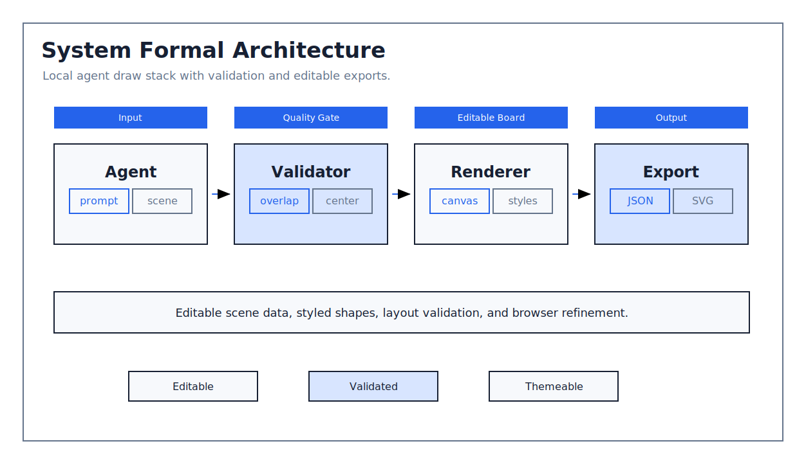
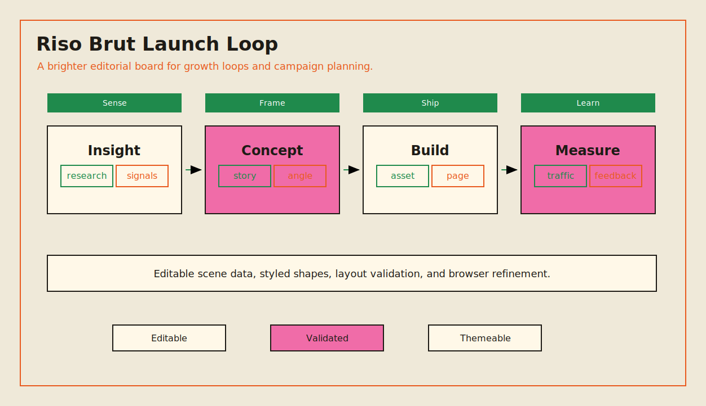
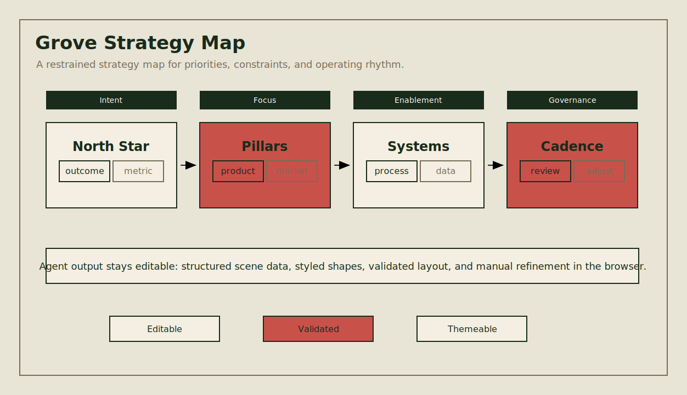
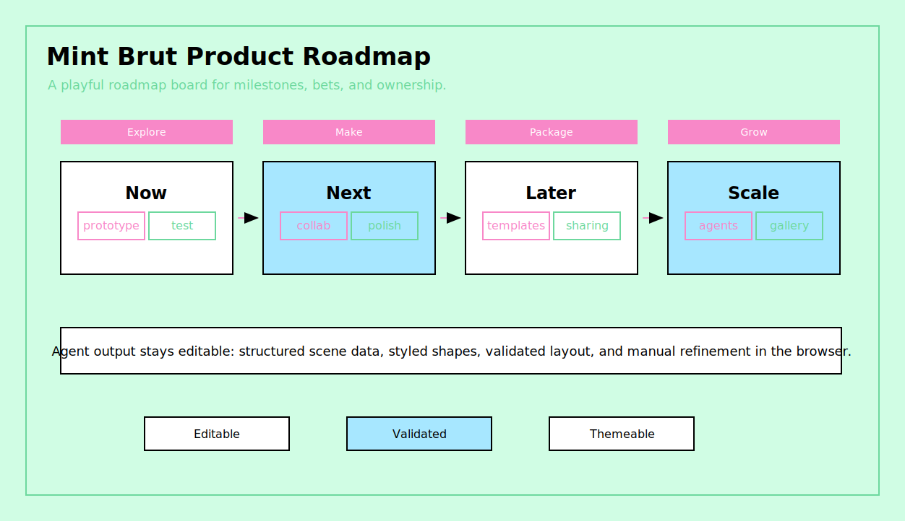

# AgentDraw

[English README](./README.md)

AgentDraw 是一个本地优先、可编辑的白板工作区，面向 Claude Code、Codex、Cursor 或其它 coding agent。

它的目标是让 agent 生成结构化的 `.agentdraw.json` 场景文件，然后在浏览器里打开一个可编辑画板。用户可以继续手动调整，也可以导出 JSON、SVG 或 PNG。

当前第一个画板 provider 是 Excalidraw。AgentDraw 把存储格式、风格系统、本地服务和校验逻辑跟画布实现解耦，后续可以继续增加其它 provider，而不用推倒整个应用。

## 画廊

AgentDraw 示例都是可编辑的真实 scene 文件。下面的图片只是 README 预览图；点击图片可以打开对应的 `.agentdraw.json` 源文件。

### 复杂示例

<a href="./examples/complex-agentdraw-workbench.agentdraw.json">
  
</a>

### 主题示例

<table>
<tr>
<td width="50%">
<a href="./examples/theme-system-formal.agentdraw.json"></a><br />
<sub><a href="./examples/theme-system-formal.agentdraw.json"><b>System Formal</b></a> · 结构化产品图</sub>
</td>
<td width="50%">
<a href="./examples/theme-riso-brut.agentdraw.json"></a><br />
<sub><a href="./examples/theme-riso-brut.agentdraw.json"><b>Riso Brut</b></a> · 编辑感增长闭环</sub>
</td>
</tr>
<tr>
<td width="50%">
<a href="./examples/theme-grove.agentdraw.json"></a><br />
<sub><a href="./examples/theme-grove.agentdraw.json"><b>Grove</b></a> · 克制策略图</sub>
</td>
<td width="50%">
<a href="./examples/theme-mint-brut.agentdraw.json"></a><br />
<sub><a href="./examples/theme-mint-brut.agentdraw.json"><b>Mint Brut</b></a> · 活泼产品路线图</sub>
</td>
</tr>
</table>

## 为什么做

Agent 生成图经常会出现几类稳定问题：文字重叠、标签没居中、连线没有接到目标、复杂图打开后被工具栏挡住。AgentDraw 把这些问题当成工程问题处理：

- 图是可编辑的结构化 JSON，不是截图；
- 风格是可复用 preset，不是一堆临时颜色；
- 打开前可以先做场景校验；
- 最后用户仍然可以在浏览器画板里直接编辑。

## 能力

- 本地 `.agentdraw.json` 场景文件。
- 基于 Excalidraw 的可编辑画布。
- 内置 38 个风格，包括正式图表风格，以及从 `beautiful-feishu-whiteboard` 迁移过来的配色。
- CLI 支持打开和校验场景。
- 本地 HTTP API 负责加载和保存当前画板。
- 支持导出 JSON、SVG、PNG。
- 场景校验支持检查文字重叠、图形覆盖、文字垂直居中、连线端点距离、连线穿过文字等问题。

## 快速开始

```bash
pnpm install
pnpm build
pnpm agentdraw open examples/complex-agentdraw-workbench.agentdraw.json
```

打开命令输出的 URL。默认本地服务地址是：

```text
http://127.0.0.1:3927
```

如果在 WSL 里工作，但浏览器在另一台机器上，可以在有浏览器的机器上启动：

```bash
pnpm agentdraw open examples/complex-agentdraw-workbench.agentdraw.json --no-open
```

## CLI

打开画板：

```bash
pnpm agentdraw open examples/getting-started.agentdraw.json
```

只启动服务，不自动打开系统浏览器：

```bash
pnpm agentdraw open examples/getting-started.agentdraw.json --no-open
```

画板打开时默认会 replay 最终场景，让用户看到图一步步被画出来。可以用下面任一 URL 参数关闭：

```text
?animate=0
?replay=0
?instant=1
```

校验 agent 生成的场景：

```bash
pnpm validate:scene examples/complex-agentdraw-workbench.agentdraw.json
```

校验器遇到 layout error 会返回非 0 退出码。warning 会打印出来，但不会让命令失败。推荐 agent 生成图时使用这个流程：

```text
生成 scene -> 校验 scene -> 根据 element id 修复 -> 打开画板
```

## 示例源文件

画廊图片由这些可编辑源文件生成：

- [`examples/getting-started.agentdraw.json`](./examples/getting-started.agentdraw.json)
- [`examples/complex-agentdraw-workbench.agentdraw.json`](./examples/complex-agentdraw-workbench.agentdraw.json)
- [`examples/theme-system-formal.agentdraw.json`](./examples/theme-system-formal.agentdraw.json)
- [`examples/theme-riso-brut.agentdraw.json`](./examples/theme-riso-brut.agentdraw.json)
- [`examples/theme-grove.agentdraw.json`](./examples/theme-grove.agentdraw.json)
- [`examples/theme-mint-brut.agentdraw.json`](./examples/theme-mint-brut.agentdraw.json)

重新生成主题示例：

```bash
node scripts/generate-theme-examples.mjs
```

重新生成 README 预览图：

```bash
pnpm examples:previews
```

## 场景格式

AgentDraw scene 是一个 JSON envelope，里面包 provider 需要的场景数据：

```json
{
  "type": "agentdraw/scene",
  "version": 1,
  "title": "System map",
  "styleId": "system-formal",
  "providerId": "excalidraw",
  "elements": [],
  "appState": {},
  "files": {}
}
```

Agent 通常生成或修改这些字段：

- `styleId`
- `providerId`
- `elements`
- `appState`
- `files`

浏览器编辑器会把用户的手动修改自动保存回同一个文件。

## 风格

可以在 scene 文件里写 `styleId`，也可以在工具栏里切换。默认风格是：

```text
system-formal
```

正式图表风格：

- `system-formal`
- `boardroom`
- `blueprint-formal`

其它配色风格按三组组织：

- restrained: `avocado-press`, `grove`, `jade-lens`, `long-table`, `macchiato`, `monochrome`,
  `papier-bleu`, `reading-room`, `salmon-stamp`
- balanced: `apricot-arc`, `berry-pop`, `bold-poster`, `checker-bloom`, `cobalt-bloom`, `coral`,
  `cut-bloom`, `editorial-forest`, `lime-slab`, `linen-cut`, `pin-and-paper`, `raw-grid`,
  `riptide-cobalt`, `soft-editorial`, `violet-marker`
- bold: `block-frame`, `burst-panel`, `confetti-wedge`, `court-press`, `crayon-stack`,
  `grove-block`, `mint-brut`, `neo-grid-bold`, `riso-brut`, `specimen-bold`, `stencil-tablet`

高正式度风格会使用更方正的几何形状、零 roughness、sans 字体和 elbow-style 默认连线。低正式度风格会保留更明显的 Excalidraw 手绘感。

## 校验

场景校验器是轻量级的，不是完整视觉渲染器。它用于在打开浏览器前提前发现常见问题：

- 文字 bounding box 重叠；
- 非包含关系的图形异常覆盖；
- 短容器里的文字组明显偏离垂直中心；
- 连线端点离最近图形太远；
- 连线穿过文字 bounding box。

重要图仍然建议打开浏览器检查一遍。

## 开发

```bash
pnpm install
pnpm typecheck
pnpm build
```

开发模式同时启动 web 和 API：

```bash
pnpm dev
```

目录结构：

```text
apps/web/          浏览器编辑器
packages/cli/      agentdraw 命令
packages/server/   本地 HTTP 服务
packages/scene/    scene 读写和校验
packages/styles/   风格目录和渲染 profile
examples/          示例场景
scripts/           仓库工具脚本
```

## 仓库

```bash
git remote add origin git@github.com:chenhg5/agentdraw.git
```

## License

暂未选择 license。
