# AgentDraw

[English README](./README.md)

AgentDraw 是一个本地优先、SVG-first、可编辑的白板工作区，面向 Claude Code、Codex、Cursor 或其它 coding agent。

它的目标是让 agent 先生成整齐、可预览的 SVG，再转换成可编辑的 `.agentdraw.json` 画板。用户可以在浏览器里继续手动调整，也可以导出 JSON、SVG 或 PNG。

当前第一个画板 provider 是 Excalidraw。AgentDraw 使用 SVG 作为 agent 友好的源草稿，使用 `.agentdraw.json` 作为浏览器可编辑格式。

Powered by [Excalidraw](https://github.com/excalidraw/excalidraw)。

## 安装

推荐：让你的 coding agent 同时安装 CLI 和 skill。

```text
安装 AgentDraw：
npm install -g @aidraw/agentdraw
npx skills add agentdraw/agentdraw --skill agentdraw -g -y
```

给 agent 的 bootstrap URL：

```text
https://raw.githubusercontent.com/agentdraw/agentdraw/main/INSTALL.md
```

如果只是人手动使用 CLI：

```bash
npm install -g @aidraw/agentdraw
agentdraw --help
agentdraw guide
```

不全局安装也可以直接运行：

```bash
npx @aidraw/agentdraw@latest import-svg board.svg --out board.agentdraw.json --style boardroom --json
npx @aidraw/agentdraw@latest open board.agentdraw.json --no-open
```

更多 agent 安装方式见 [INSTALL.md](./INSTALL.md)。

## 画廊

AgentDraw 示例都是可编辑的真实 scene 文件。下面的图片只是 README 预览图；点击图片可以打开对应的 `.agentdraw.json` 源文件。

### 复杂示例

<a href="./examples/complex-agentdraw-workbench.agentdraw.json">
  
</a>

### 版式示例

这些示例展示的是表达结构，不只是换一套配色。点击图片可以打开对应的可编辑
`.agentdraw.json` scene。版式规则见
[`editorial-layouts.md`](./skills/agentdraw/method/editorial-layouts.md)。

<table>
<tr>
<td width="50%"><a href="./examples/layouts/01-monochrome-big-number.agentdraw.json">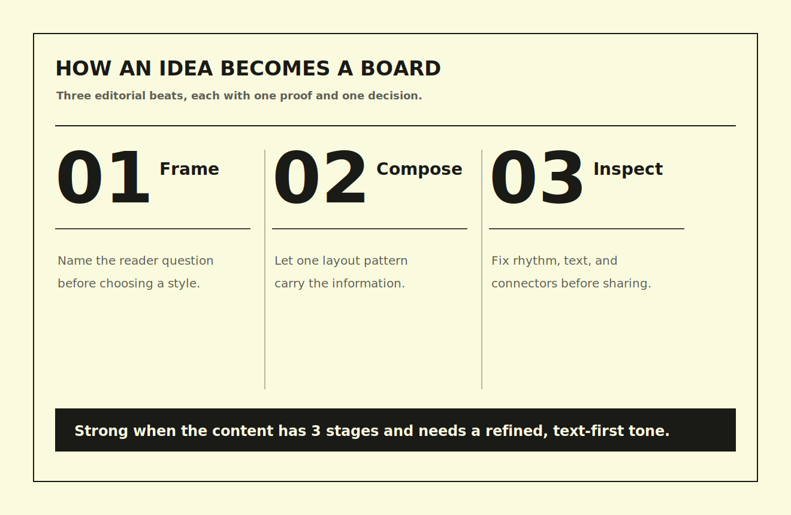</a><br />
<sub><a href="./skills/agentdraw/method/editorial-layouts.md#e01-monochrome-big-number"><b>E01 Monochrome Big Number</b></a> · 三阶段论点表达</sub>
</td>
<td width="50%"><a href="./examples/layouts/02-reading-room-overlap.agentdraw.json">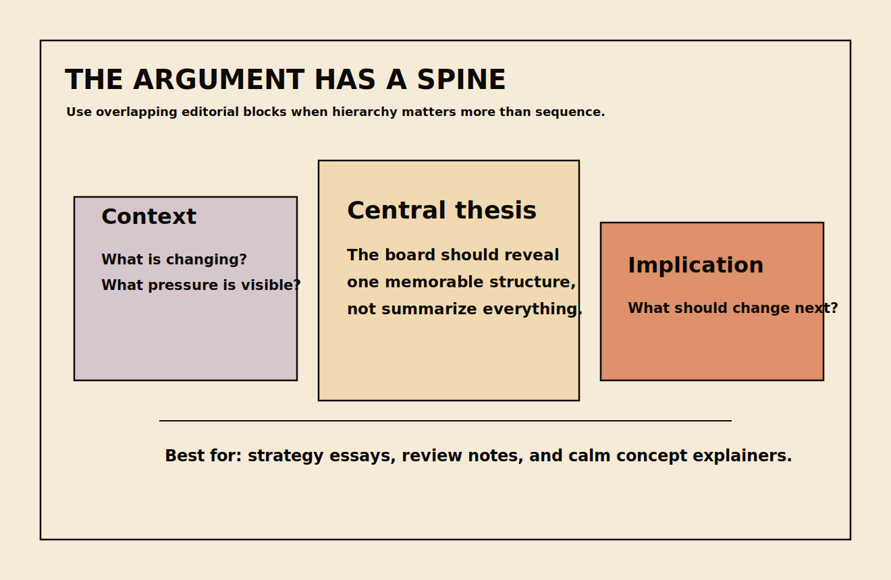</a><br />
<sub><a href="./skills/agentdraw/method/editorial-layouts.md#e02-reading-room-overlap"><b>E02 Reading Room Overlap</b></a> · 平静观点和错落面板</sub>
</td>
</tr>
<tr>
<td width="50%"><a href="./examples/layouts/03-swiss-statement-grid.agentdraw.json">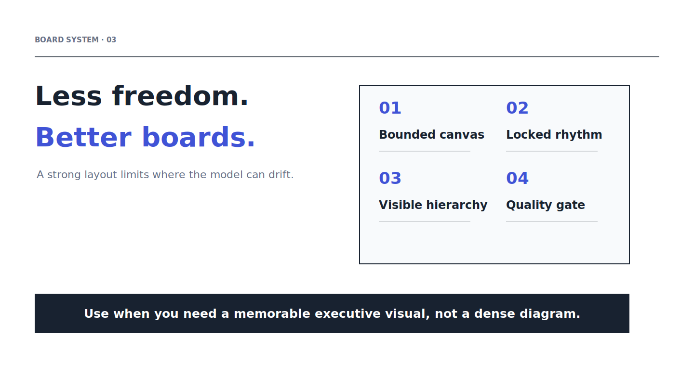</a><br />
<sub><a href="./skills/agentdraw/method/editorial-layouts.md#e03-swiss-statement-grid"><b>E03 Swiss Statement Grid</b></a> · 结论主张加证据网格</sub>
</td>
<td width="50%"><a href="./examples/layouts/04-editorial-sidebar.agentdraw.json">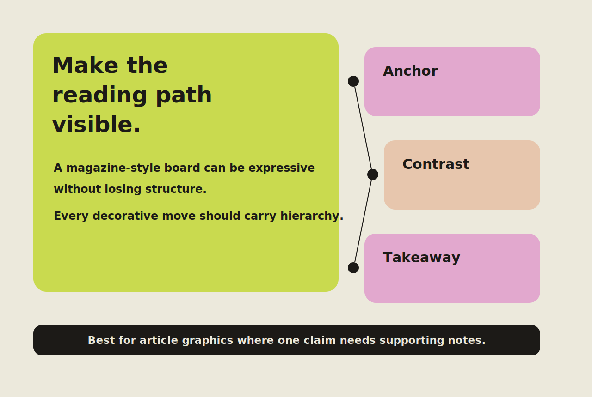</a><br />
<sub><a href="./skills/agentdraw/method/editorial-layouts.md#e04-editorial-sidebar"><b>E04 Editorial Sidebar</b></a> · 非对称文章配图</sub>
</td>
</tr>
<tr>
<td width="50%"><a href="./examples/layouts/05-poster-ledger.agentdraw.json">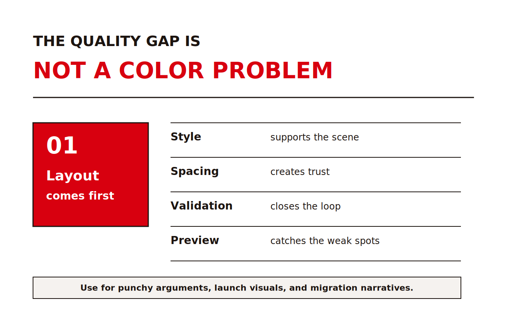</a><br />
<sub><a href="./skills/agentdraw/method/editorial-layouts.md#e05-poster-ledger"><b>E05 Poster Ledger</b></a> · 强标题加规则化证据行</sub>
</td>
<td width="50%"><a href="./examples/layouts/06-reading-room-index.agentdraw.json">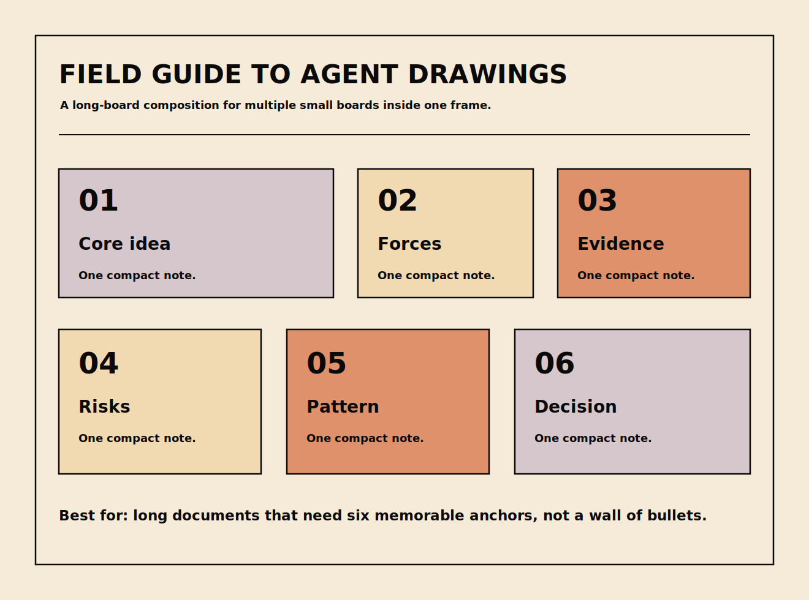</a><br />
<sub><a href="./skills/agentdraw/method/editorial-layouts.md#e06-reading-room-index"><b>E06 Reading Room Index</b></a> · 长文档综合和多个记忆锚点</sub>
</td>
</tr>
<tr>
<td width="50%"><a href="./examples/layouts/07-strategic-quadrant.agentdraw.json">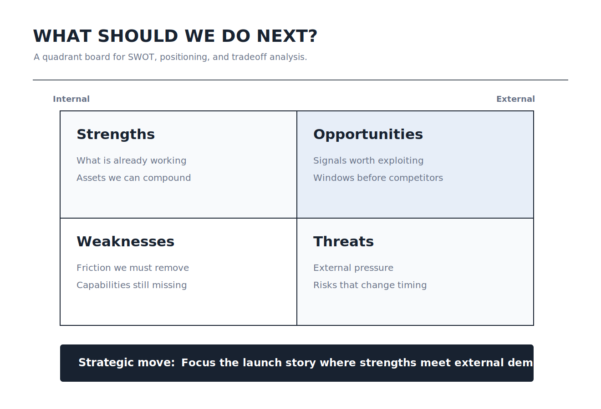</a><br />
<sub><a href="./skills/agentdraw/method/editorial-layouts.md#e07-strategic-quadrant"><b>E07 Strategic Quadrant</b></a> · SWOT 和定位分析</sub>
</td>
<td width="50%"><a href="./examples/layouts/08-editorial-timeline.agentdraw.json">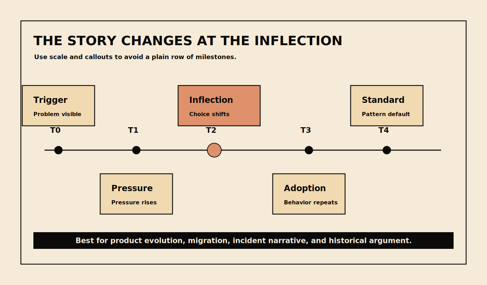</a><br />
<sub><a href="./skills/agentdraw/method/editorial-layouts.md#e08-editorial-timeline"><b>E08 Editorial Timeline</b></a> · 时间演进和关键转折点</sub>
</td>
</tr>
<tr>
<td width="50%"><a href="./examples/layouts/09-roadmap-terrace.agentdraw.json">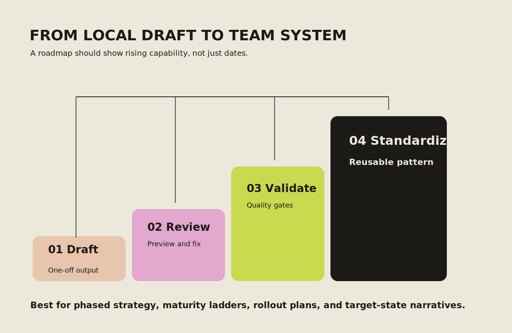</a><br />
<sub><a href="./skills/agentdraw/method/editorial-layouts.md#e09-roadmap-terrace"><b>E09 Roadmap Terrace</b></a> · 阶段路线图和成熟度台阶</sub>
</td>
<td width="50%"><a href="./examples/layouts/10-decision-scoreboard.agentdraw.json">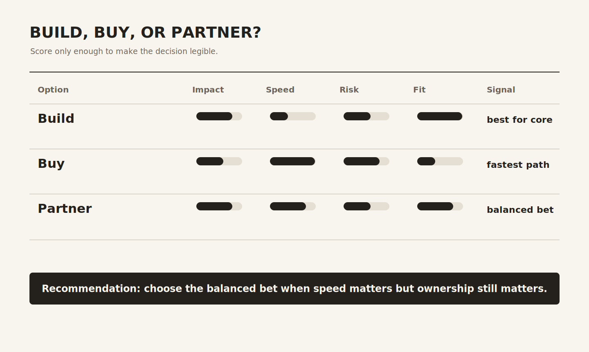</a><br />
<sub><a href="./skills/agentdraw/method/editorial-layouts.md#e10-decision-scoreboard"><b>E10 Decision Scoreboard</b></a> · 方案对比和推荐结论</sub>
</td>
</tr>
<tr>
<td width="50%"><a href="./examples/layouts/11-ecosystem-orbit.agentdraw.json">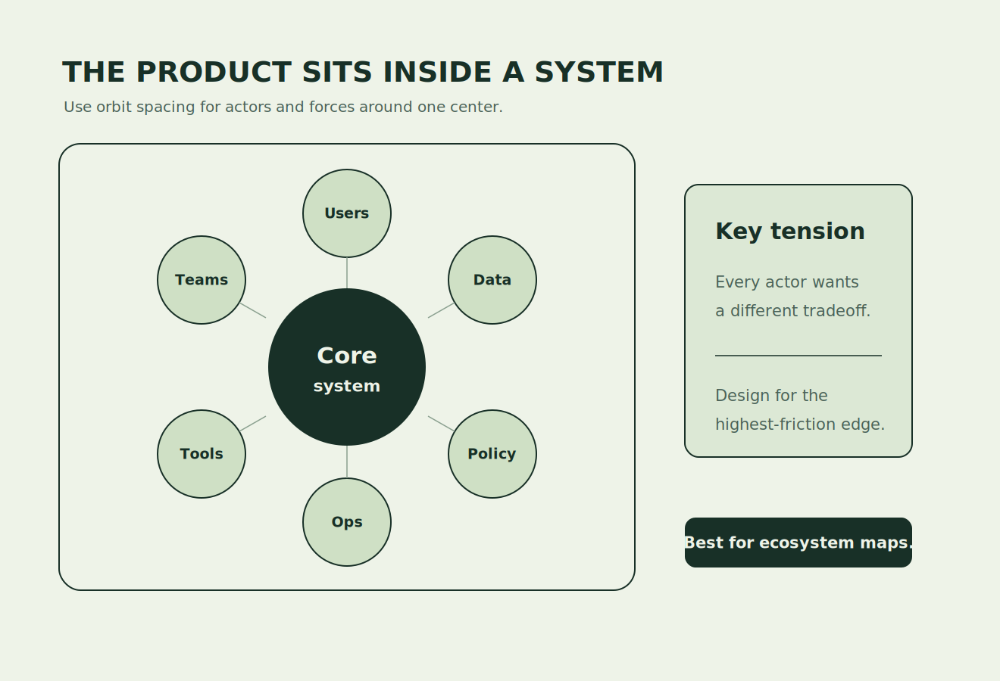</a><br />
<sub><a href="./skills/agentdraw/method/editorial-layouts.md#e11-ecosystem-orbit"><b>E11 Ecosystem Orbit</b></a> · 利益相关方和生态关系图</sub>
</td>
<td width="50%"><a href="./examples/layouts/12-pyramid-stack.agentdraw.json">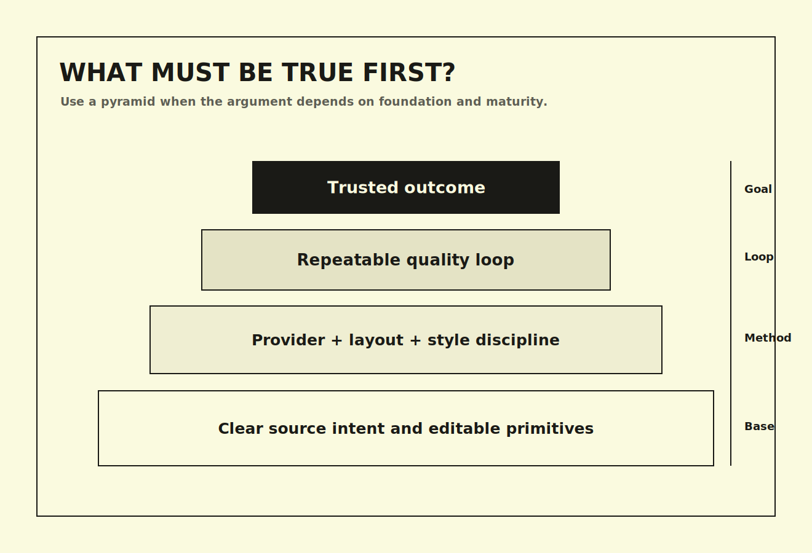</a><br />
<sub><a href="./skills/agentdraw/method/editorial-layouts.md#e12-pyramid-stack"><b>E12 Pyramid Stack</b></a> · 层级、成熟度和依赖关系</sub>
</td>
</tr>
</table>

### 主题示例

<table>
<tr>
<td width="50%"><a href="./examples/theme-agentdraw-os.agentdraw.json"></a><br />
<sub><a href="./examples/theme-agentdraw-os.agentdraw.json"><b>AgentDraw OS</b></a> · 本地 agent 作图闭环</sub>
</td>
<td width="50%"><a href="./examples/theme-incident-command.agentdraw.json"></a><br />
<sub><a href="./examples/theme-incident-command.agentdraw.json"><b>Incident Command</b></a> · 故障响应和复盘图</sub>
</td>
</tr>
<tr>
<td width="50%"><a href="./examples/theme-message-bus.agentdraw.json"></a><br />
<sub><a href="./examples/theme-message-bus.agentdraw.json"><b>Message Bus</b></a> · 多 agent 协作图</sub>
</td>
<td width="50%"><a href="./examples/theme-launch-room.agentdraw.json"></a><br />
<sub><a href="./examples/theme-launch-room.agentdraw.json"><b>Launch Room</b></a> · 增长发布闭环</sub>
</td>
</tr>
<tr>
<td width="50%"><a href="./examples/theme-strategy-grove.agentdraw.json"></a><br />
<sub><a href="./examples/theme-strategy-grove.agentdraw.json"><b>Strategy Grove</b></a> · 季度策略图</sub>
</td>
<td width="50%"><a href="./examples/theme-roadmap-mint.agentdraw.json"></a><br />
<sub><a href="./examples/theme-roadmap-mint.agentdraw.json"><b>Roadmap Mint</b></a> · 创作工具路线图</sub>
</td>
</tr>
<tr>
<td width="50%"><a href="./examples/theme-customer-journey.agentdraw.json"></a><br />
<sub><a href="./examples/theme-customer-journey.agentdraw.json"><b>Customer Journey</b></a> · 用户旅程信号图</sub>
</td>
<td width="50%"><a href="./examples/theme-research-synthesis.agentdraw.json"></a><br />
<sub><a href="./examples/theme-research-synthesis.agentdraw.json"><b>Research Synthesis</b></a> · 访谈聚类分析图</sub>
</td>
</tr>
<tr>
<td width="50%"><a href="./examples/theme-raw-grid.agentdraw.json"></a><br />
<sub><a href="./examples/theme-raw-grid.agentdraw.json"><b>Raw Grid</b></a> · 严格校验矩阵</sub>
</td>
<td width="50%"><a href="./examples/theme-bold-poster.agentdraw.json"></a><br />
<sub><a href="./examples/theme-bold-poster.agentdraw.json"><b>Bold Poster</b></a> · 高冲击设计观点图</sub>
</td>
</tr>
<tr>
<td width="50%"><a href="./examples/theme-soft-editorial.agentdraw.json"></a><br />
<sub><a href="./examples/theme-soft-editorial.agentdraw.json"><b>Soft Editorial</b></a> · 研究和产品发现板</sub>
</td>
<td width="50%"><a href="./examples/theme-block-frame.agentdraw.json"></a><br />
<sub><a href="./examples/theme-block-frame.agentdraw.json"><b>BlockFrame</b></a> · 创作工作流图</sub>
</td>
</tr>
</table>

## 为什么做

Agent 直接生成白板 JSON 经常会出现几类稳定问题：文字重叠、标签没居中、连线没有接到目标、坐标不对齐。AgentDraw 把这些问题当成工程问题处理：

- 标准结构图走 Mermaid，自定义说明类视觉走受限 SVG；
- 再转换成可编辑的结构化 JSON，不是截图；
- 风格是可复用设计系统，不是一堆临时颜色；
- 版式是明确的表达策略，不是自由拼装装饰；
- 打开前可以先做修复、场景校验和质量评分；
- 最后用户仍然可以在浏览器画板里直接编辑。

AgentDraw 的目标很直接：尽可能少的 token，尽可能快的生成时间，尽可能好的第一版结果。Agent 不应该从零手写复杂白板 JSON，除非是在 patch 已有画板。它应该先选择最稳定、最省成本的源格式，让 AgentDraw 负责转换，然后只在重要图里使用校验、质量评分和预览导出来闭环。

## 架构理念

AgentDraw 把 AI 作图里经常混在一起的环节拆开：

```text
意图/输入材料
  -> provider 路由
  -> 设计风格
  -> 版式风格
  -> Mermaid 或 SVG 源文件
  -> 可编辑 .agentdraw.json
  -> repair / validate / quality / preview
  -> 本地浏览器编辑器
```

### Provider 路由

如果图本身已经有成熟语法，就优先用 Mermaid：流程图、时序图、类图、状态图、ER 图、时间线、用户旅程等。对这类结构明确的图，Mermaid 通常更省 token、更快，也更稳定。

如果是说明类配图、文章插图、架构说明、分层结构、机制图、策略单页、类似 PPT 的单页视觉，就用受限 SVG。SVG 让 agent 能直接控制层级、间距、排版、字体和构图，同时仍然能导入成可编辑对象。

### 设计风格 vs 版式风格

设计风格控制视觉语言：配色、字体、几何形状、连线、间距、密度和避免规则。每个内置风格都有 agent 可读的 `design.md` 和机器可读的 design contract。

版式风格控制信息结构。AgentDraw 要求 agent 在画 SVG 前先选一个固定版式，例如 contrast split、center mechanism、layered stack、pipeline、loop、matrix、timeline、orbit map、assertion pillars、hero evidence、bento brief、decision ladder。

这层拆分是质量控制的核心。Agent 不应该只是“选一个主题然后画框”，而应该先判断表达场景，再选 provider，再选设计系统，最后选版式模式。

### 质量闭环

重要画板推荐走这个闭环：

```text
plan -> 生成 Mermaid/SVG -> import -> repair -> validate -> quality -> 导出预览 -> 修改源文件 -> open
```

`agentdraw validate` 会检查可确定的布局问题，例如元素重叠、文字垂直居中偏移、连线端点错误和风格 contract drift。`agentdraw quality` 会补一层轻量评分，用来评估结构、可读性、连线质量和可编辑性。skill 里也定义了 P0/P1 质量门槛：P0/P1 问题应该在交付前修掉。

## 能力

- SVG-first agent 作图流程，并输出本地 `.agentdraw.json` 可编辑文件。
- 受限 SVG importer，支持 `rect`、`circle`、`ellipse`、`line`、`polyline`、`text/tspan`、group 和箭头 marker。
- 基于 Excalidraw 的可编辑画布。
- 内置 44 个风格，包括正式图表风格，以及从 `beautiful-feishu-whiteboard` 迁移过来的配色。
- CLI 支持打开和校验场景。
- 本地 HTTP API 负责加载和保存当前画板。
- 支持导出 JSON、SVG、PNG。
- 场景校验支持检查文字重叠、图形覆盖、文字垂直居中、连线端点距离、连线穿过文字等问题。

## 快速开始

先把 SVG 转成可编辑画板，再打开：

```bash
npx @aidraw/agentdraw@latest import-svg board.svg --out board.agentdraw.json --style boardroom --json
npx @aidraw/agentdraw@latest repair board.agentdraw.json --style boardroom --write --json
npx @aidraw/agentdraw@latest validate board.agentdraw.json --style boardroom --json
npx @aidraw/agentdraw@latest open board.agentdraw.json --no-open
```

或者使用仓库源码：

```bash
pnpm install
pnpm build
pnpm agentdraw open examples/complex-agentdraw-workbench.agentdraw.json
```

打开命令输出的 URL。默认本地服务地址是：

```text
http://127.0.0.1:3927
```

使用 `--background` 时，AgentDraw 会先检查目标端口上是否已经有 AgentDraw server。如果已经在运行，就复用这个 server，并返回当前文件的 URL，不会再启动一个新进程。如果端口被其它服务占用，命令会失败并提示换一个 `--port`。这样多个 agent 反复执行 `open --background` 时不会持续泄漏后台服务。

如果在 WSL 里工作，但浏览器在另一台机器上，可以在有浏览器的机器上启动：

```bash
pnpm agentdraw open examples/complex-agentdraw-workbench.agentdraw.json --no-open
```

## 多个画板

一个 AgentDraw 文件是一个可编辑的无限画布 scene。你可以在同一个白板里放多个相关画板区域，例如：

- 一个总览图加两个细节图；
- 一次评审里放三张文章配图；
- before / after 图加共享图例；
- 流程图旁边放架构说明图。

对 agent 来说，推荐做法是先生成一个包含多个清晰区域的 SVG，再导入成一个 `.agentdraw.json`。这些区域应该有一致的间距、标题和外边界，这样每个区域都能作为一个独立画板阅读。

AgentDraw 目前还没有一等的多页/artboard 模型，也没有用于合并多个 `.agentdraw.json` 的 `merge` 命令。如果是互不相关的一组图，先生成多个文件；如果需要一个展示画布，就在一个 SVG 里排多个 panel 后再导入。

## CLI

发现命令：

```bash
pnpm agentdraw --help
pnpm agentdraw schema open --json
pnpm agentdraw guide styles --json
```

打开画板：

```bash
pnpm agentdraw open examples/getting-started.agentdraw.json
```

只启动服务，不自动打开系统浏览器：

```bash
pnpm agentdraw open examples/getting-started.agentdraw.json --no-open
```

只创建 scene 文件，不启动编辑器：

```bash
pnpm agentdraw init .agentdraw/board.agentdraw.json
```

把受限 SVG 转成可编辑画板：

```bash
pnpm agentdraw import-svg .agentdraw/board.svg --out .agentdraw/board.agentdraw.json --style boardroom --title "Agent workflow" --json
```

画板默认直接打开最终场景。只有在明确想看绘制过程时，才用下面任一 URL 参数开启 replay：

```text
?animate=1
?replay=1
```

校验 agent 生成的场景：

```bash
pnpm validate:scene examples/complex-agentdraw-workbench.agentdraw.json
pnpm agentdraw validate examples/complex-agentdraw-workbench.agentdraw.json --format json
```

校验器遇到 layout error 会返回非 0 退出码。warning 会打印出来，但不会让命令失败。推荐 agent 生成图时使用这个流程：

```text
选择风格 -> 加载 design guide + contract -> 生成受限 SVG -> 预览/检查 SVG -> import-svg -> repair -> validate -> quality -> 必要时修改 SVG 重来 -> 打开画板
```

## 示例源文件

画廊图片由这些可编辑源文件生成：

- [`examples/getting-started.agentdraw.json`](./examples/getting-started.agentdraw.json)
- [`examples/complex-agentdraw-workbench.agentdraw.json`](./examples/complex-agentdraw-workbench.agentdraw.json)
- [`examples/theme-agentdraw-os.agentdraw.json`](./examples/theme-agentdraw-os.agentdraw.json)
- [`examples/theme-incident-command.agentdraw.json`](./examples/theme-incident-command.agentdraw.json)
- [`examples/theme-message-bus.agentdraw.json`](./examples/theme-message-bus.agentdraw.json)
- [`examples/theme-launch-room.agentdraw.json`](./examples/theme-launch-room.agentdraw.json)
- [`examples/theme-strategy-grove.agentdraw.json`](./examples/theme-strategy-grove.agentdraw.json)
- [`examples/theme-roadmap-mint.agentdraw.json`](./examples/theme-roadmap-mint.agentdraw.json)
- [`examples/theme-customer-journey.agentdraw.json`](./examples/theme-customer-journey.agentdraw.json)
- [`examples/theme-research-synthesis.agentdraw.json`](./examples/theme-research-synthesis.agentdraw.json)
- [`examples/theme-raw-grid.agentdraw.json`](./examples/theme-raw-grid.agentdraw.json)
- [`examples/theme-bold-poster.agentdraw.json`](./examples/theme-bold-poster.agentdraw.json)
- [`examples/theme-soft-editorial.agentdraw.json`](./examples/theme-soft-editorial.agentdraw.json)
- [`examples/theme-block-frame.agentdraw.json`](./examples/theme-block-frame.agentdraw.json)

重新生成主题示例：

```bash
node scripts/generate-theme-examples.mjs
```

重新生成 README 预览图：

```bash
pnpm examples:previews
```

## SVG-First 格式

推荐让 agent 先生成受限 SVG：

```svg
<svg width="1200" height="760" viewBox="0 0 1200 760" xmlns="http://www.w3.org/2000/svg">
  <defs>
    <marker id="arrow" markerWidth="10" markerHeight="10" refX="8" refY="5" orient="auto">
      <path d="M 0 0 L 10 5 L 0 10 z" fill="#64748B" />
    </marker>
  </defs>
  <rect x="80" y="80" width="1040" height="600" rx="10" fill="#FFFFFF" stroke="#172033" />
  <text x="120" y="140" font-family="Inter, Arial, sans-serif" font-size="34" font-weight="750" fill="#172033">System map</text>
</svg>
```

当前 importer 支持 `svg`、`g`、`rect`、`circle`、`ellipse`、`line`、`polyline`、`text`、`tspan`、`defs`、`marker`。文字要保留为真实文本，不要转成 path。可编辑画板里不要使用 `foreignObject`、`image`、`clipPath`、`mask`、`filter`、渐变和任意 path 图形。

## 场景格式

AgentDraw scene 是 `agentdraw import-svg` 生成的浏览器可编辑存储格式。Agent 应该把它当作生成结果，而不是源绘图语言。

只有在修改已有画板的高级场景下，才直接 patch 这些字段：

- `styleId`
- `providerId`
- `elements`
- `appState`
- `files`

浏览器编辑器会把用户的手动修改自动保存回同一个文件。

## 风格

可以在 scene 文件里写 `styleId`，也可以在工具栏里切换。默认风格是：

```text
system-formal
```

风格后续应该是设计系统，而不只是换配色。目标架构见
[`docs/STYLE_SYSTEM.md`](./docs/STYLE_SYSTEM.md)，agent 可读的风格规则会放在
`packages/styles/designs/*/design.md`。

正式图表风格：

- `system-formal`
- `boardroom`
- `blueprint-formal`

其它配色风格按三组组织：

- restrained: `archive-shelf`, `avocado-press`, `espresso-paper`, `grove`, `inkline`, `jade-lens`,
  `long-table`, `manual-cream`, `papier-bleu`, `runtime-doc`, `salmon-stamp`, `slate-notes`
- balanced: `apricot-arc`, `berry-pop`, `bold-poster`, `checker-bloom`, `cobalt-bloom`, `coral`,
  `cut-bloom`, `editorial-forest`, `incident-dark`, `lime-slab`, `linen-cut`, `pin-and-paper`,
  `raw-grid`, `riptide-cobalt`, `soft-editorial`, `soft-pop`, `violet-marker`
- bold: `block-frame`, `burst-panel`, `confetti-wedge`, `court-press`, `crayon-stack`,
  `grove-block`, `mint-brut`, `neo-grid-bold`, `neon-grid`, `riso-brut`, `specimen-bold`,
  `stencil-tablet`

高正式度风格会使用更方正的几何形状、零 roughness、sans 字体和 elbow-style 默认连线。低正式度风格会保留更明显的 Excalidraw 手绘感。

## 校验

场景校验器是轻量级的，不是完整视觉渲染器。它用于在打开浏览器前提前发现常见问题：

- 文字 bounding box 重叠；
- 非包含关系的图形异常覆盖；
- 短容器里的文字组明显偏离垂直中心；
- 连线端点离最近图形太远；
- 连线穿过文字 bounding box。

重要图仍然建议打开浏览器检查一遍。

## 开发

```bash
pnpm install
pnpm typecheck
pnpm build
```

## Agent Skill

其它 agent 应该安装 [`skills/agentdraw/SKILL.md`](./skills/agentdraw/SKILL.md)，然后通过 CLI 读取版本匹配的作图指南：

```bash
agentdraw guide styles --json
agentdraw guide style system-formal --format text
agentdraw guide quality --format text
```

## 评估

可以用 [`evals/`](./evals) 检查这个 skill 是否真的能产出有用、可编辑、有设计感的画板。第一版 eval 包含真实 prompt 和一个 24 分 rubric，覆盖任务命中、结构、视觉设计、可读性、连线质量和校验结果。

开发模式同时启动 web 和 API：

```bash
pnpm dev
```

目录结构：

```text
apps/web/          浏览器编辑器
packages/cli/      agentdraw 命令
packages/server/   本地 HTTP 服务
packages/scene/    scene 读写和校验
packages/styles/   风格目录和渲染 profile
examples/          示例场景
scripts/           仓库工具脚本
```

## 灵感来源

AgentDraw 受到这些项目和理念的启发：

- [Excalidraw](https://github.com/excalidraw/excalidraw)：提供了可编辑白板体验，让 AI 草稿可以继续被人手动调整。
- [Mermaid](https://github.com/mermaid-js/mermaid)：适合标准结构图，尤其是流程图、时序图、类图等语法明确的图。
- [Drawnix](https://github.com/plait-board/drawnix)：开源白板编辑和本地绘图工作流的重要参考。
- [beautiful-feishu-whiteboard](https://github.com/zarazhangrui/beautiful-feishu-whiteboard)：证明了 agent 可读的设计指导可以显著提升白板视觉质量。
- [open-design](https://github.com/nexu-io/open-design)：启发我们把 AI 视觉输出看成设计运行时问题，而不仅是 prompt 问题。
- [Google design.md](https://github.com/google-labs-code/design.md)：启发我们把设计规则写成 agent 能读取和执行的规范。
- [guizang-ppt-skill](https://github.com/op7418/guizang-ppt-skill) 和
  [html-ppt-skill](https://github.com/lewislulu/html-ppt-skill)：在版式纪律、主题系统和演示视觉约束上提供了参考。
- [next-ai-draw-io](https://github.com/DayuanJiang/next-ai-draw-io)、
  [ai-excalidraw](https://github.com/co-pine/ai-excalidraw)、
  [fireworks-tech-graph](https://github.com/yizhiyanhua-ai/fireworks-tech-graph)、
  [architecture-diagram-generator](https://github.com/Cocoon-AI/architecture-diagram-generator)，以及 GitHub 的
  [excalidraw-diagram-generator skill](https://github.com/github/awesome-copilot/blob/main/skills/excalidraw-diagram-generator/SKILL.md)：这些 AI 辅助作图项目在 prompt 结构、架构图生成、Excalidraw 生成方式上都有参考价值，也帮助我们明确 AgentDraw 应该专注在本地、可编辑、面向 agent 的工作流。

## 仓库

```bash
git remote add origin git@github.com:agentdraw/agentdraw.git
```

## License

[MIT](./LICENSE)

AgentDraw 基于 [Excalidraw](https://github.com/excalidraw/excalidraw) 构建。
